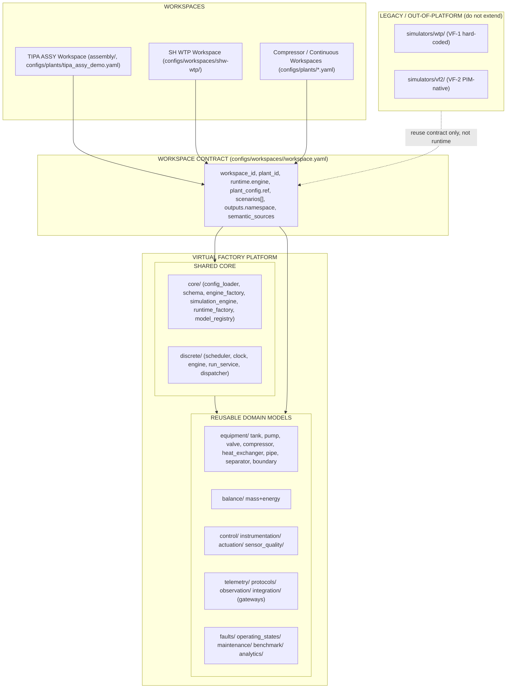

# 13 — Recommended Target Architecture

Adapted from gate §15 to the actual repo evidence.



## 13.1 Key architectural decisions (from evidence)

1. **Two execution kernels** already exist and are domain-neutral:
   `core/` (continuous tick loop) and `discrete/` (scheduler/event kernel).
   SH WTP uses `core/` — no new kernel.
2. **Model layer is config-registered and reusable** (`configs/model_types/*` +
   `equipment/*`). SH WTP adds WTP model types as reusable domain models, not
   workspace-local code.
3. **Workspace layer becomes explicit** via `configs/workspaces/<id>/workspace.yaml`
   (§06, §11). It is the only new concept, and it is config-level (no new
   runtime code).
4. **ASSY stays as-is** — a self-contained, project-specific discrete workspace
   with the strongest existing provenance. It is *not* migrated in PH00.
5. **`simulators/wtp` (VF-1) and `simulators/vf2` (VF-2) are legacy/out-of-platform**
   — they are read for their contract/validation patterns but their engines are
   not extended. SH WTP must not become a third standalone simulator.

## 13.2 Target flow (SH WTP, PH01+)

```text
workspace.yaml (manifest)
  → semantic_sources (pinned, read-only)
  → plant.yaml (PlantConfig)
  → core.runtime_factory + ModelRegistry (reuse)
  → core.SimulationEngine (reuse)
  → scenarios (workspace-scoped)
  → telemetry frame + workspace_id provenance
  → protocol/integration gateways (namespace-isolated)
```

## 13.3 What must NOT happen (guardrails)

- No new water-treatment engine.
- No move/rewrite of `assembly/`.
- No import of `simulators/*` into `src/virtual_factory`.
- No SHW id in ASSY output and vice versa (§07).
