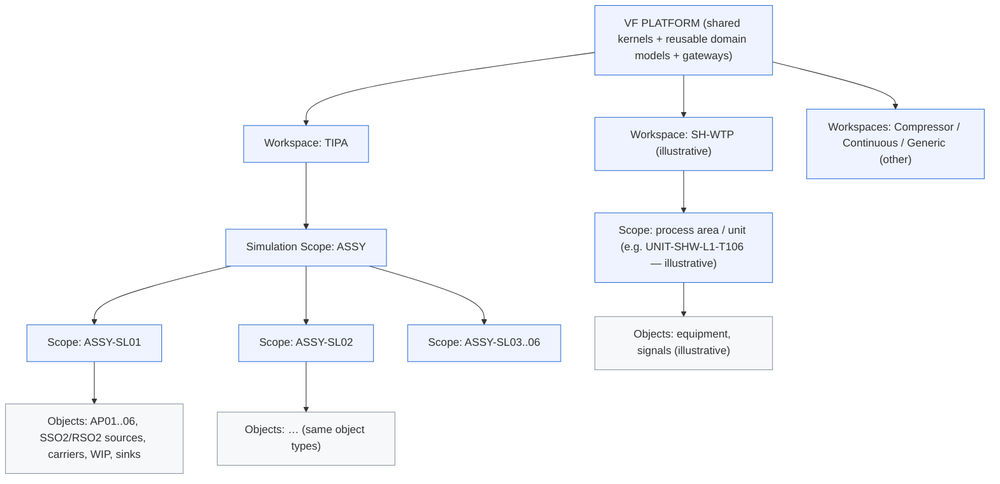

# 03 — Structural Model, Identity Invariants & Hierarchy Rules

## 3.1 Structural model (diagram)



Textual equivalent:

```
VF Platform
└─ Workspace (top-level grouping; 1 platform → many workspaces)
   └─ Simulation Scope (nested; may recurse)
      └─ Simulation Scope (child) … and/or
      └─ Simulation Object (leaf)
```

**Invariant:** containment is a tree (one parent per scope/object). Connectivity
is a graph (many edges, independent of the tree) — see evidence 04.

## 3.2 Identity invariant table

| Invariant | Rule |
|---|---|
| `workspace_id` vs `scope_id` | `workspace_id` is top-level; `scope_id` is nested under a workspace (or another scope). A scope path `workspace_id/…scope_id…` is unique. |
| Child scope uniqueness | A `scope_id` is unique **within its parent scope/workspace boundary**, not necessarily globally. |
| Object identity boundary | Object/runtime keys are unique **within their owning scope**; the same object id may repeat in different scopes without collision. |
| Standalone vs federated | Identity semantics are identical in both modes for **executable-capable scopes**; federation only adds parent/composition context (evidence 04). Container-only scopes are addressable/grouping nodes and are not subject to the standalone/federated runtime contract. |
| `outputs.namespace` separation | `outputs.namespace` is a protocol token bound to `workspace_id`; NOT equal to scope path; NOT a canonical id. |
| PIM canonical separation | VF `workspace_id`/`scope_id`/object id are VF structural identity; PIM canonical ids are semantic identity. Neither silently replaces the other. |
| Provenance readiness | Identities are stable and independent of UI labels, so future provenance threading can reference them without re-keying. |

No concrete class/API is frozen here — semantics first (Issue #40 §B).

## 3.3 Hierarchy rules (Issue #40 §C)

1. **Allowed parent/child:** Platform → Workspace → Scope → (Scope | Object).
   An Object may NOT contain scopes or objects.
2. **Recursive depth:** Scope nesting is recursive but shallow in practice
   (ASSY → ASSY-SL01 = one level of scope nesting under a workspace; SH WTP
   area → unit = one-to-two levels). No artificial depth limit is frozen; the
   contract permits recursion while existing references stay shallow.
3. **Runtime per scope:** Not every scope must own a runtime. A scope MAY be a
   structural/container scope with no direct execution (it only groups child
   scopes and/or objects).
4. **Container scopes without execution:** Allowed. A container scope groups
   children and may expose navigation/inspection, but is not required to be
   independently executable.
5. **Object membership:** Every object belongs to exactly one scope
   (containment). An object may be referenced by graph edges from anywhere
   (connectivity is not containment).
6. **Child scopes + objects simultaneously:** A scope MAY expose both child
   scopes and direct objects (e.g. ASSY exposes ASSY-SL01..06 as child scopes;
   an area scope could expose equipment objects directly).
7. **Addressable vs executable:** A scope may be independently addressable and
   inspectable (navigation, snapshot, config read) WITHOUT being independently
   executable. Executability is an orthogonal capability, not implied by
   existence.
8. **Executability is a capability, not a type default (C01):** `executability`
   is a characteristic of a Simulation Scope, not a consequence of the node
   type. A scope is **executable** (owns a runtime/execution boundary) or
   **container-only** (groups child scopes and/or objects only). The
   standalone/federated contract (evidence 04) applies only to executable-capable
   scopes.
