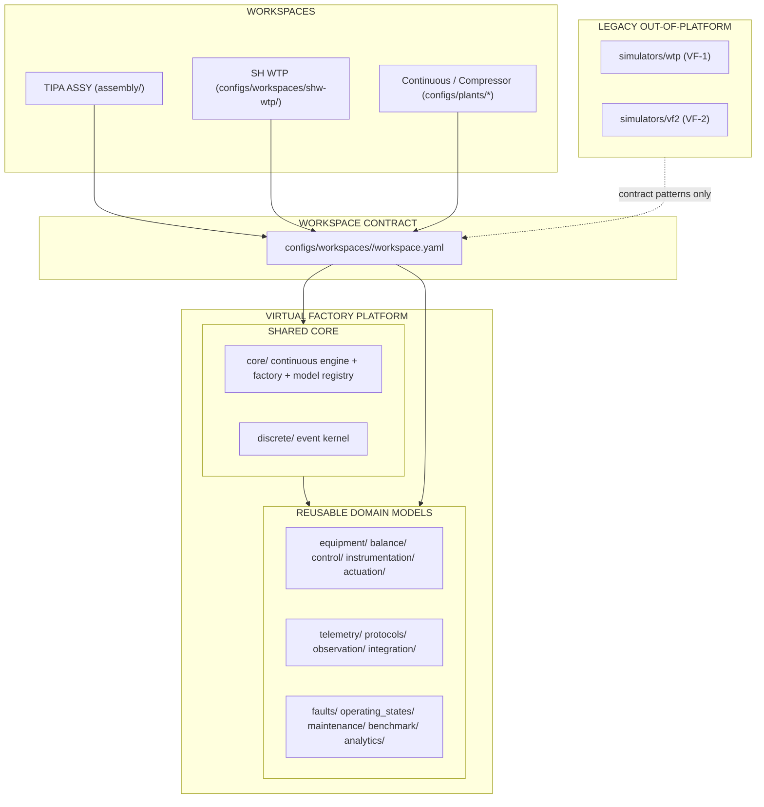

# SHW-VF-PH00 — Workspace & Multi-Simulation Architecture Preflight

| Field | Value |
|---|---|
| Task ID | `SHW-VF-PH00` (C02 — canonical-main re-audit + SA contract corrections) |
| Repository | `hieudovn/virtual-factory` |
| Gate type | READ-ONLY / ARCHITECTURE PREFLIGHT (+ C02 correction, `.ai-harness/` only) |
| Audit baseline | canonical `main` @ `25a02a520f8371345242879954d7822553e9d004` (post VF-REPO-LINEAGE-01 merge; CLOSED) |
| Production code changed | **NO** (only `.ai-harness/` governance artifacts) |
| SHW runtime implemented | **NO** |

## 1. Objective

Determine how the repo currently organizes its multiple simulations so that the
Sông Hồng Water Treatment Plant (SH WTP) becomes a **workspace of the existing
VF platform** rather than another independent mini-simulator. Read-only; no
restructure, no promotion, no PlantOS/MES work.

## 2. Headline findings

1. **There is no workspace concept today.** Plant selection is `--config`;
   scenario selection is `--scenario`; dispatch is a single `model_type`
   discriminator (`engine_factory.resolve_engine_kind`, only knows
   `continuous_process`); `plant.type` is ignored metadata.
2. **Three disjoint runtime entrypoints exist inside the platform:**
   - `core/` continuous engine (`SimulationEngine`) — config-driven;
   - `discrete/` event kernel (`DiscreteSimulationEngine`/`DiscreteRunService`);
   - `assembly/` TIPA ASSY (`DemoController` + `AssyLineRuntime`, env
     `TIPA_ASSY_CONFIG`) — hard-coded topology;
   - plus `assembly/definition_io` generic-discrete demo.
3. **Two standalone WTP simulators exist OUTSIDE the platform:** `simulators/wtp`
   (VF-1, hard-coded 92-signal WTP chain) and `simulators/vf2` (VF-2,
   PIM-native). Both are separate mini-engines — the exact anti-pattern this
   gate prevents. The §9 draft `examples/song-hong-wtp/vf_consumer/` does **not**
   exist; the only WTP contract artifact is
   `examples/contracts/wtp-demo-01.contract.yaml` (9-area stub).
4. **The continuous engine already serves two domains** (water transfer MVP,
   gas-compression benchmark) purely via config + the generic `ModelRegistry`
   (15 reusable model types). This is the pattern SH WTP must follow.
5. **Boundary violations exist but are non-blocking for PH00** (flagged, not
   fixed): `core/` imports `equipment`/`balance`; TIPA topology hard-coded in
   `assembly/tipa.py`; `compressor_benchmark_scenarios.yaml` uses an unloadable
   `inject_fault` format; `/assy-demo/*` endpoints mixed into the generic API.

## 3. Recommended workspace architecture (summary)

- **Workspace container:** `configs/workspaces/shw-wtp/` (additive; reuses
  `--config`/`--scenario`; no new top-level). Evidence §11.
- **Workspace manifest:** frozen in evidence §06 (`workspace_id`, `plant_id`,
  `runtime.engine: continuous_process`, `semantic_binding.mode: required`,
  `plant_config.ref`, `scenarios[]`, `outputs.namespace`, `semantic_sources` +
  separate `compatibility` block). See C02 corrections below.
- **Runtime:** existing `core.SimulationEngine` + `ModelRegistry`; SH WTP adds
  WTP model types as **reusable domain models** (`equipment/` +
  `configs/model_types/*`), never a new engine.
- **Output provenance:** add `workspace_id`, `fidelity`, `data_status`
  (`synthetic`/`simulated_ground_truth`), `semantic_contract_*` to the
  telemetry frame/envelope (evidence §10). `canonical_signal_id` is PIM-owned
  and consumed read-only; VF uses `runtime_signal_id` as its internal key.
- **Isolation:** namespace threading + 10-item test plan (evidence §07).
- **Fidelity:** `LogicalOnly` / `SyntheticReference` / `FirstOrder`; SH WTP
  starts at `logical_only` (evidence §09).
- **PIM:** immutable, versioned, content-hash-pinned references (evidence §12).



## 4. Acceptance criteria

| # | Criterion | Result |
|---|---|---|
| A01 | No production code changed | PASS (only `.ai-harness/` artifacts) |
| A02 | Existing simulations inventoried | PASS (§evidence 01/02/04/05) |
| A03 | ASSY runtime packaging understood | PASS (evidence 04) |
| A04 | Shared-vs-workspace boundary mapped | PASS (evidence 03) |
| A05 | Workspace contract proposed | PASS (evidence 06) |
| A06 | Workspace selection mechanism proposed | PASS (evidence 02/06) |
| A07 | Isolation test plan defined | PASS (evidence 07) |
| A08 | Core-change governance defined | PASS (evidence 08) |
| A09 | SHW placement recommendation produced | PASS (evidence 11) |
| A10 | PIM immutable-consumption boundary defined | PASS (evidence 12) |
| A11 | Fidelity governance defined | PASS (evidence 09) |
| A12 | Output provenance contract proposed | PASS (evidence 10) |
| A13 | No SHW runtime implementation performed | PASS |

## 5. STOP-condition assessment

| Stop condition | Assessment |
|---|---|
| ASSY architecture conflicts irreconcilably | NO — ASSY is a separate SA-accepted family; no conflict blocks the workspace design |
| Incompatible workspace mechanisms already exist | NO — no workspace mechanism exists to conflict with |
| SHW requires shared-core change before design closes | NO — design closes without core change; only the *implementation* of `workspace_id` threading needs a future CORE gate |
| Repo restructure required before PH01 | NO — `configs/workspaces/` is additive |
| Existing entrypoints cannot be isolated safely | NO — isolation plan (§07) is additive |
| PIM contract shape required to decide a VF core API | NO — VF core API already fixed; PIM affects mapping/config only |
| Workspace isolation cannot be achieved without breaking demos | NO |

**Conclusion: no STOP condition is triggered.**

## 6. SA decisions — CLOSED (C02)

C02 applied the SA contract corrections B1–B10 (see evidence §16). No open
questions remain:

1. **B7** `simulators/wtp` + `simulators/vf2` = LEGACY / REFERENCE (no new SH WTP
   development there; no import as runtime deps).
2. **B9** workspace root = `configs/workspaces/` (SH WTP target
   `configs/workspaces/shw-wtp/`); no top-level `workspaces/`.
3. **B8** workspace provenance threading requires a dedicated CORE gate (not
   folded into PH01).
4. **B10** `runtime.fidelity_ceiling: logical_only`; increases require evidence
   + SA-reviewed gate.
5. **B1/B2** PIM owns `canonical_signal_id`; VF consumes read-only; VF internal
   key = `runtime_signal_id`/`local_signal_id`/`model_signal_key`;
   `workspace_id ≠ canonical_signal_id ≠ outputs.namespace`.
6. **B3** `runtime.engine: continuous_process` (not `vf-core`).
7. **B4** `semantic_binding.mode: required` for SH WTP (fail-closed).
8. **B5** PIM owns artifact/version/SHA; compatibility decided by VF/PIM
   integration review.
9. **B6** `origin_kind: simulation`; data status `synthetic` /
   `simulated_ground_truth` (not plain `measured`/`ground_truth`).

## 7. Evidence

`.ai-harness/sa-review/evidence/SHW-VF-PH00/` — 16 files (01…16; §15 = C01
baseline reconciliation [superseded by C02], §16 = C02 re-audit + corrections).

## 8. Final status

```text
SHW-VF-PH00-C02 — READY FOR SA REVIEW
```

PH00 remains NOT CLOSED; SHW-VF-PH01 is **not** started. The PM does not
self-certify COMPLETE/CLOSED.
