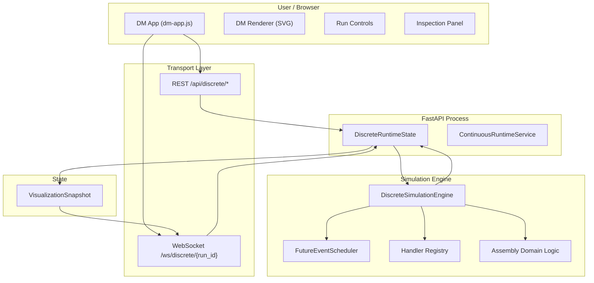
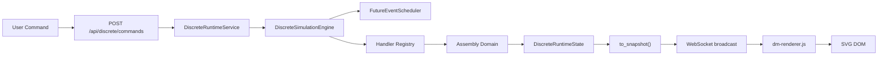

# 04 — End-to-End Runtime and Visualization Architecture

**Date:** 2026-08-05

---

## 1. Component Architecture



---

## 2. Component Specifications

### 2.1 `DiscreteSimulationEngine`

| Aspect | Specification |
|--------|--------------|
| **Responsibility** | Orchestrate event loop, dispatch events to handlers, manage run lifecycle |
| **Owned state** | `DiscreteRuntimeState`, `FutureEventScheduler`, handler registry reference |
| **Public interface** | `initialize(run_context)`, `step()`, `run_auto()`, `pause()`, `stop()` |
| **Forbidden** | Manufacturing domain logic, visualization, I/O, direct scheduling without dispatch |
| **Dependency direction** | Depends on: kernel (`DiscreteClock`, `ScheduledEvent`, `FutureEventScheduler`, `RunContext`), handler registry, domain logic. No reverse dependencies. |
| **Package** | `virtual_factory/discrete/engine.py` |

### 2.2 Handler Registry

| Aspect | Specification |
|--------|--------------|
| **Responsibility** | Map event types to handler functions |
| **Owned state** | `dict[str, Callable]` — event_type → handler |
| **Public interface** | `register(event_type, handler)`, `dispatch(event) → DispatchResult` |
| **Forbidden** | Scheduling, state mutation, domain logic |
| **Dependency direction** | Depends on: `ScheduledEvent`. Depended on by: `DiscreteSimulationEngine` |
| **Package** | `virtual_factory/discrete/handler.py` |

### 2.3 `DiscreteRuntimeState`

| Aspect | Specification |
|--------|--------------|
| **Responsibility** | Hold authoritative mutable simulation state |
| **Owned state** | Run status, simulation time, node states, entity/WIP states, counters, diagnostics |
| **Public interface** | Properties for state access, `to_snapshot()` → `VisualizationSnapshot` |
| **Forbidden** | Visualization logic, I/O, direct mutation from outside engine |
| **Dependency direction** | Depends on: domain model types. Depended on by: engine, snapshot projection |
| **Package** | `virtual_factory/discrete/state.py` |

### 2.4 `DiscreteRuntimeService`

| Aspect | Specification |
|--------|--------------|
| **Responsibility** | Own one `DiscreteSimulationEngine`, expose run control API, manage WebSocket broadcasts |
| **Owned state** | Engine reference, run list, active WebSocket connections |
| **Public interface** | `create_run()`, `start_run()`, `step_run()`, `pause_run()`, `stop_run()`, `get_snapshot()` |
| **Forbidden** | Continuous engine access, domain logic |
| **Dependency direction** | Depends on: engine, snapshot. Depended on by: API routes |
| **Package** | `virtual_factory/ui/discrete_runtime_service.py` |

### 2.5 `VisualizationSnapshot`

| Aspect | Specification |
|--------|--------------|
| **Responsibility** | Immutable projection of runtime state for visualization |
| **Owned state** | Run metadata, node states, entity positions, counters, allowed actions |
| **Public interface** | `to_dict()` for JSON serialization |
| **Forbidden** | Mutable state, business logic |
| **Dependency direction** | Depends on: domain state types. Depended on by: WebSocket, REST |
| **Package** | `virtual_factory/discrete/snapshot.py` |

### 2.6 `DMRenderer`

| Aspect | Specification |
|--------|--------------|
| **Responsibility** | Render DM visualization snapshot to SVG with incremental updates |
| **Owned state** | DOM element references, selection state, viewport state |
| **Public interface** | `render(snapshot)`, `selectNode(id)`, `zoomIn/Out/Fit()` |
| **Forbidden** | Simulation state, business logic, direct engine access |
| **Dependency direction** | Depends on: snapshot, layout template. Depended on by: dm-app.js |
| **Package** | `ui/static/discrete/dm-renderer.js` |

---

## 3. Component Diagram — Data Flow



---

## 4. Continuous Engine Protection

| Rule | Mechanism |
|------|-----------|
| Separate service class | `DiscreteRuntimeService` vs `ContinuousRuntimeService` — no shared mutable state |
| Separate endpoints | `/api/discrete/*` vs existing `/status`, `/step`, etc. |
| Separate WebSocket | `/ws/discrete/{run_id}` vs `/ws/telemetry` |
| Separate state | `DiscreteRuntimeState` vs `RuntimeState` — no inheritance |
| Separate renderer | `dm-renderer.js` vs `editor.js` — no shared SVG root |
| Shared only | FastAPI process, static hosting, CSS tokens, widget library, icon library |

---

## 5. Dependency Direction Summary

```
Kernel (clock, events, scheduler, run_context)
  ← Engine (orchestration, lifecycle)
    ← Handler Registry (event_type → function)
      ← Domain Logic (assembly, routing, entity lifecycle)
        ← Runtime State (authoritative mutable state)
          ← Snapshot Projection (immutable view)
            ← Transport (REST, WebSocket)
              ← UI Renderer (SVG, inspection)

UI Commands → Transport → Service → Engine → Scheduler
```
