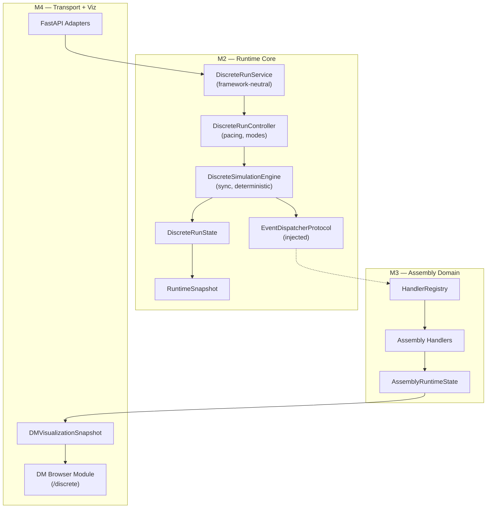

# 04-v2 — End-to-End Runtime and Visualization Architecture (Corrected)

**Date:** 2026-08-05  
**Replaces:** `04-end-to-end-runtime-visualization-architecture.md`  
**Corrections:** F-001, F-002, F-003

---

## 1. Dependency Direction (C-001)

```
discrete kernel (clock, events, scheduler, run_context)
  → DiscreteSimulationEngine (deterministic, synchronous, domain-neutral)
    → EventDispatcherProtocol (injected port, not domain logic)
      → HandlerRegistry (M2-S02)
        → Assembly Domain (M3)
          → AssemblyRuntimeState (M3)
            → DMVisualizationSnapshot (M4)

DiscreteRunController (wall-clock pacing, mode management)
  → DiscreteSimulationEngine (commands only)
  → SnapshotBroadcaster (publish on state change)

DiscreteRunService (framework-neutral)
  → DiscreteRunController

FastAPI adapters (M4 transport slice)
  → DiscreteRunService
```

**Key rule:** Engine depends on a dispatcher *protocol*, never on assembly domain. Controller handles pacing, not engine.

---

## 2. State Split (C-002)

### M2 — Domain-Neutral

```python
@dataclass
class DiscreteRunState:
    """M2: engine lifecycle + diagnostics only. No assembly domain."""
    run_id: str
    status: RunStatus
    simulation_time_s: float
    processed_events: int
    pending_events: int
    last_event_id: str | None
    stop_reason: str | None          # "completed", "stopped", "failed: ..."
    failure_error: str | None
    snapshot_sequence: int           # increments per committed transition
    diagnostics: dict[str, Any]
```

```python
@dataclass(frozen=True)
class RuntimeSnapshot:
    """M2: immutable domain-neutral projection."""
    run_id: str
    status: str
    simulation_time_s: float
    processed_events: int
    pending_events: int
    stop_reason: str | None
    snapshot_sequence: int
```

### M3 — Assembly Domain

```python
@dataclass
class AssemblyRuntimeState:
    """M3: nodes, routes, entities, resources."""
    nodes: dict[str, NodeState]
    routes: dict[str, RouteState]
    entities: dict[str, EntityState]
    resources: dict[str, ResourceState]

@dataclass(frozen=True)
class DMVisualizationSnapshot:
    """M4: full UI projection including assembly state."""
    # ... runtime fields + nodes, entities, routes, resources
```

---

## 3. Engine Contract (C-003)

```python
class DiscreteSimulationEngine:
    """Deterministic, synchronous, domain-neutral.
    
    Responsibilities:
    - Owns FutureEventScheduler and DiscreteRunState
    - step_event() pops and dispatches one event
    - run_until(condition) for batch execution
    - stop() / fail() lifecycle transitions
    
    Does NOT:
    - asyncio, sleep, wall-clock pacing
    - WebSocket, HTTP, I/O
    - domain logic, entity lifecycle
    - auto-run loops
    """

    def __init__(self, run_context: RunContext, dispatcher: EventDispatcherProtocol): ...
    def initialize(self) -> None: ...
    def step_event(self) -> RuntimeSnapshot: ...
    def run_until(self, condition: Callable[[DiscreteRunState], bool], max_events: int | None = None) -> list[RuntimeSnapshot]: ...
    def stop(self, reason: str = "stopped") -> RuntimeSnapshot: ...
    
    @property
    def status(self) -> RunStatus: ...
    @property 
    def state(self) -> DiscreteRunState: ...
    def to_snapshot(self) -> RuntimeSnapshot: ...
```

---

## 4. RunController (C-003)

```python
class DiscreteRunController:
    """Wall-clock pacing, mode management, command queue.
    
    Owns:
    - DiscreteSimulationEngine
    - command queue
    - snapshot broadcaster reference
    
    Responsibilities:
    - auto_run(speed_factor) → asyncio loop with pacing
    - pause() / resume()
    - accept_command(cmd) → queue
    - apply_commands_at_safe_point()
    - broadcast_snapshot_on_change()
    """

    def __init__(self, engine: DiscreteSimulationEngine): ...
    async def auto_run(self, speed_factor: float = 1.0) -> None: ...
    def pause(self) -> None: ...
    def resume(self) -> None: ...
    def accept_command(self, cmd: DMCommand) -> CommandResult: ...
```

---

## 5. Component Diagram


