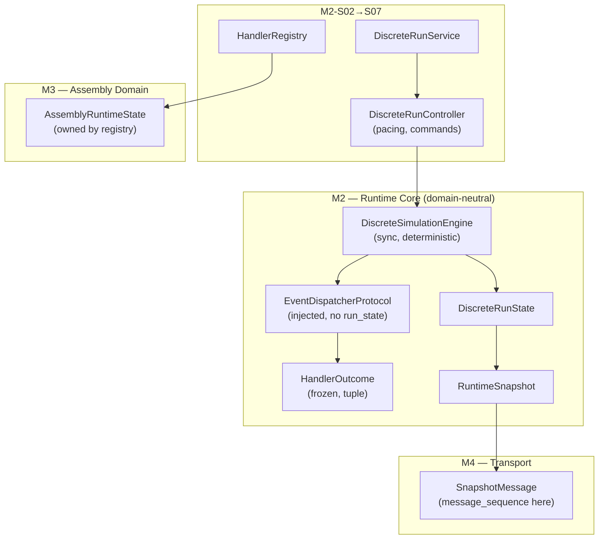

# 04-v3 — End-to-End Architecture (Final)

**Date:** 2026-08-05  
**Replaces:** `04-...-v2.md`  
**Corrections:** V2-F02, V2-F03, V2-F04

---

## 1. Dependency Direction

```
Kernel (clock, events, scheduler, run_context)
  → DiscreteSimulationEngine (sync, deterministic, domain-neutral)
    → EventDispatcherProtocol (injected port; no run_state access)
      → HandlerRegistry (concrete, M2-S02)
        → AssemblyRuntimeState (owned by registry/handlers in M3)

DiscreteRunController (pacing, modes, commands)
  → DiscreteSimulationEngine
  → Command Queue

DiscreteRunService (framework-neutral, one run)
  → DiscreteRunController

FastAPI Adapters (M4)
  → DiscreteRunService
  → SnapshotMessage envelope (transport sequencing)
```

---

## 2. State Split

| State | Owner | Milestone | Purpose |
|-------|-------|-----------|---------|
| `DiscreteRunState` | Engine | M2-S01 | Lifecycle, counters, diagnostics |
| `RuntimeSnapshot` | Engine → `to_snapshot()` | M2-S01 | Immutable domain-neutral projection |
| `AssemblyRuntimeState` | HandlerRegistry (M3) | M3 | Nodes, entities, routes, resources |
| `DMVisualizationSnapshot` | M4 projection layer | M4 | Full UI projection |
| `SnapshotMessage` | M4 transport | M4 | Envelope with `message_sequence` |

---

## 3. Engine Contract

```python
class DiscreteSimulationEngine:
    """Deterministic, synchronous, domain-neutral.

    Does NOT contain: asyncio, WebSocket, HTTP, domain logic,
    auto-run loops, transport sequencing, RNG.
    """

    def __init__(self, run_context: RunContext, dispatcher: EventDispatcherProtocol): ...
    def initialize(self, initial_events: Iterable[ScheduledEvent] = ()) -> RuntimeSnapshot: ...
    def step_event(self) -> RuntimeSnapshot: ...
    def stop(self, reason: str = "stopped") -> RuntimeSnapshot: ...

    @property
    def status(self) -> RunStatus: ...
    @property
    def state(self) -> DiscreteRunState: ...
    def to_snapshot(self) -> RuntimeSnapshot: ...
```

### RuntimeSnapshot v1 (M2-S01)

```python
@dataclass(frozen=True)
class RuntimeSnapshot:
    schema_version: str = "1.0.0"
    run_id: str
    model_id: str
    model_version: str | None
    scenario_id: str | None
    scenario_version: str | None
    status: str
    simulation_time_s: float
    stop_reason: str | None
    failure_error: str | None
    processed_events: int
    pending_events: int
    last_event_id: str | None
    snapshot_sequence: int
```

**Excluded from RuntimeSnapshot:** `message_sequence` (M4 transport), `allowed_actions` (M2-S04 controller projection).

---

## 4. Slice Ownership Map

| Contract | Slice |
|----------|-------|
| `RunStatus` | M2-S01 |
| `DiscreteRunState` | M2-S01 |
| `RuntimeSnapshot` | M2-S01 |
| `EventDispatcherProtocol` | M2-S01 |
| `HandlerOutcome` | M2-S01 |
| `DiscreteSimulationEngine` | M2-S01 |
| `HandlerRegistry` (concrete) | M2-S02 |
| Bounded event trace | M2-S03 |
| `DiscreteRunController` | M2-S04 |
| `SnapshotMessage` (transport) | M4-S02 |

---

## 5. Component Diagram


