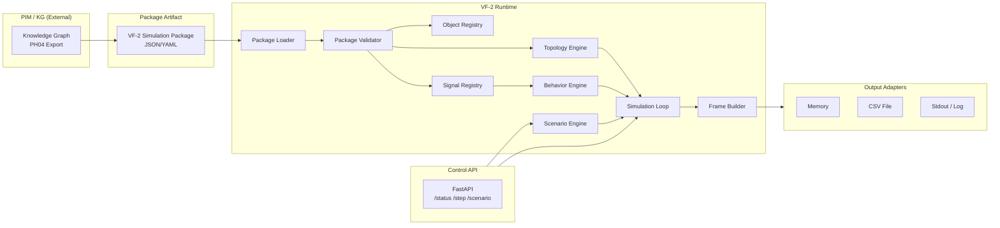

# VF-2 — PIM-native Simulation Runtime Roadmap

> **Status:** APPROVED WITH CORRECTIVE NOTES — SA Review 2026-07-10  
> **ST00 Schema Alignment:** COMPLETED — see `docs/vf2-st00-schema-alignment.md`  
> **Date:** 2026-07-10  
> **Repository:** `virtual-factory`  
> **Module:** `simulators/vf2/` (new, isolated from VF-1)

---

## 1. Executive Summary

**VF-2** is the next-generation Virtual Factory simulation runtime that consumes **PIM-generated simulation packages** instead of manually authored contracts or hardcoded signal registries.

**Key difference from VF-1:**

```
VF-1 (WTP):  Contract YAML → hardcoded SignalRegistry → WTP-specific stage formulas → PlantOS ingest
VF-2 (PIM):  PIM Package JSON → dynamic registry → generic behavior engine → local output
```

VF-2 proves that a governed Knowledge Graph (PIM/KG) can be the single source of truth for industrial simulation — replacing ad-hoc code with declarative packages.

---

## 2. Why VF-2

### Current VF-1 limitations

| Limitation | Impact |
|-----------|--------|
| **Hardcoded signal registry** (92 WTP-specific IDs in `signal_registry.py`) | Every new plant model requires rewriting signal lists, stage functions, and accumulators |
| **Hardcoded physics** (8 WTP stage functions in `simulation_loop.py`) | Cannot simulate a pump station, electrical substation, or any non-WTP process |
| **Contract format tied to PlantOS** (Integration Contract v2) | Couples simulation source to a specific downstream consumer |
| **No package portability** | A simulation cannot be authored once and run in multiple environments |

### VF-2 addresses these by

- **Dynamic registries** — objects, signals, topology, and scenarios loaded from a package
- **Generic behavior engine** — pattern-based (sine, random_walk, constant, dependent) with no domain-specific physics
- **Package-driven** — PIM/KG generates packages; VF-2 consumes them
- **Runtime-light** — no PlantOS, no OPC UA, no MQTT in MVP; local output only

---

## 3. Relationship with Existing VF-1 WTP Simulator

```
virtual-factory/
├── simulators/
│   ├── wtp/              ← VF-1: STABLE, UNCHANGED
│   │   ├── main.py
│   │   ├── simulation_loop.py     (WTP-specific stage formulas)
│   │   ├── signal_registry.py     (hardcoded 92 WTP signals)
│   │   ├── clarification_engine.py
│   │   ├── filtration_engine.py
│   │   ├── disinfection_engine.py
│   │   ├── energy_engine.py
│   │   ├── kpi_engine.py
│   │   ├── ingest_client.py       (PlantOS HTTP)
│   │   ├── opcua_gateway.py
│   │   └── ...
│   │
│   └── vf2/              ← VF-2: NEW, ISOLATED, PIM-NATIVE
│       ├── main.py
│       ├── models.py              (reuses MVConfig/DVConfig/Measurement patterns)
│       ├── package_loader.py      (NEW — PIM package JSON reader)
│       ├── package_validator.py   (NEW — schema + cross-reference validation)
│       ├── object_registry.py     (NEW — dynamic, loaded from package)
│       ├── signal_registry.py     (NEW — dynamic, loaded from package)
│       ├── topology_engine.py     (NEW — builds graph from package topology)
│       ├── behavior_engine.py     (reuses sine/random_walk/constant, adds formal dependent)
│       ├── scenario_engine.py     (reuses ScenarioManager + Transition patterns)
│       ├── simulation_loop.py     (reuses orchestration pattern, generic stages)
│       ├── frame_builder.py       (reuses Measurement + _build_measurements pattern)
│       ├── output/                (NEW — memory, CSV, stdout adapters)
│       │   ├── memory_output.py
│       │   ├── csv_output.py
│       │   └── stdout_output.py
│       ├── api_server.py          (reuses endpoint patterns, generic)
│       ├── config.yaml
│       ├── examples/
│       │   └── sample_pim_package.json
│       └── tests/
│           ├── test_package_loader.py
│           ├── test_package_validator.py
│           ├── test_dynamic_signal_registry.py
│           ├── test_topology_engine.py
│           ├── test_behavior_engine.py
│           ├── test_scenario_engine.py
│           └── test_simulation_loop.py
```

### Reuse strategy

| VF-1 Pattern | VF-2 Reuse | Notes |
|-------------|-----------|-------|
| `MVConfig`, `DVConfig`, `Measurement`, `SignalType` enum | ✅ Direct reuse (copy into `vf2/models.py`) | These data models are domain-agnostic |
| `SimulationState` | ⚠️ Partial reuse | Keep `time_s`, `step_count`, `mv_values`, `dv_values`, `pv_values`, `kpi_values`. Replace 14 WTP accumulators with `dict[str, float]` generic accumulator store |
| `clamp()`, `compute_quality()`, `seeded_rng()` | ✅ Direct reuse | Pure utility functions |
| `DisturbanceEngine` behavior patterns | ✅ Pattern reuse, new implementation | Keep sine/random_walk/constant math but add configurable `mean_reversion_rate`, `step_std`. Add formal `dependent` pattern |
| `ActuatorEngine` (SP → MV with slew + accuracy) | ✅ Pattern reuse | Identical concept, clean-room implementation |
| `ScenarioManager` + `ScenarioTransition` | ✅ Pattern reuse | 100% generic — only coupling is to `ActuatorEngine.actuators[sid]` and `DVEngine.configs[sid]` |
| `WtpSimulationLoop` orchestration (phase 0-1 → stages → frame build) | ✅ Pattern reuse | Replace 8 WTP stage functions with generic behavior resolution via topology |
| `_build_measurements()` frame builder | ✅ Pattern reuse | Iterate dynamic registries instead of hardcoded lists |
| `WtpApiServer` endpoint structure | ✅ Pattern reuse | All 13 endpoints are generic |
| `WtpConfig` + `load_config()` | ✅ Pattern reuse | Add `output` section, remove `plantos` section |
| `signal_registry.py` hardcoded constants | ❌ DO NOT REUSE | Must be fully dynamic — loaded from PIM package |

### Isolation rule

```
VF-2 MUST NOT import any module from `simulators/wtp/`.
VF-2 MUST NOT import any module from `src/virtual_factory/`.
VF-2 SHOULD NOT import from PlantOS repository.
```

All shared patterns (MVConfig, DVConfig, Measurement, utilities) will be re-implemented in `simulators/vf2/models.py` — no cross-module dependencies.

---

## 4. Product Objective

Create a **PIM-native simulation runtime** that:

1. Consumes PIM-generated simulation packages as its sole input
2. Builds all registries (objects, signals, topology) dynamically from the package
3. Runs pattern-based simulations (sine, random_walk, constant, dependent)
4. Supports fault/scenario injection with topology-aware impact propagation
5. Outputs measurement frames locally (memory, CSV, stdout)
6. Proves that simulation can be built from a governed Knowledge Graph

---

## 5. Technical Objective

Build a **minimal runtime** (`simulators/vf2/`) that:

| # | Capability | Validation |
|---|-----------|-----------|
| 1 | Load a PIM-generated VF-2 simulation package | Package parses without error |
| 2 | Validate objects, signals, topology, scenarios | All cross-references resolve |
| 3 | Build dynamic object registry from package | `object_registry.get(id)` returns config |
| 4 | Build dynamic signal registry from package | `signal_registry.all_signal_ids` returns all IDs |
| 5 | Build topology/dependency graph | Topological sort produces valid eval order |
| 6 | Run simple simulation behaviors (constant, sine, random_walk) | 60 steps produce valid values |
| 7 | Run dependent signal behavior (formula-based) | Dependent values match transform |
| 8 | Run basic fault/scenario effects (pump_trip, feeder_trip) | Scenario signals change, downstream impacted |
| 9 | Output measurement frames locally (memory, CSV, stdout) | Frames contain all registered signals |
| 10 | Support dry-run testing without PlantOS | `--steps 60 --output csv` succeeds |

---

## 6. In Scope (VF-2 MVP)

```
✅ New isolated `simulators/vf2/` module
✅ PIM simulation package loader (JSON)
✅ Package schema models (objects, signals, topology, scenarios, validation_rules)
✅ Package validator (schema + cross-reference checks)
✅ Dynamic object registry (loaded from package, not hardcoded)
✅ Dynamic signal registry (loaded from package, not hardcoded)
✅ Topology/dependency graph builder (topological sort)
✅ Generic behavior engine: constant, sine, random_walk, dependent
✅ Scenario engine: pump_trip, feeder_trip, disturbance/deviation
✅ Scenario transition (smooth interpolation, reused from VF-1)
✅ Simulation loop (generic orchestrator)
✅ Measurement frame builder
✅ Local output adapters: memory, CSV, stdout/log
✅ Lightweight API server: /health, /status, /step, /run, /scenario/{id}
✅ Package validation tests
✅ Dry-run simulation tests (≥60 steps)
```

---

## 7. Out of Scope (VF-2 MVP)

```
❌ PlantOS integration
❌ PlantOS HTTP ingest
❌ OPC UA output adapter
❌ MQTT output adapter
❌ Production runtime (single-thread OK)
❌ Advanced physics (no CFD, no chemical kinetics, no electrical load flow)
❌ P&ID import
❌ UI / dashboard
❌ Direct Neo4j connection
❌ Live PIM API package fetch
❌ Replacement of VF-1 WTP simulator
❌ Rewrite of any VF-1 code
```

---

## 8. Architecture Direction

### 8.1 High-Level Data Flow



### 8.2 Runtime Flow (one tick)

```
1. BehaviorEngine.step(dt)
   → For each signal: apply behavior pattern (sine/random_walk/constant/dependent)
   → Returns {signal_id: value, quality}

2. ScenarioEngine.apply_effects(state)
   → If scenario active with effects: override specified signals
   → Returns {signal_id: forced_value}

3. TopologyEngine.propagate(state, values)
   → Resolve dependent signals via topological order
   → Evaluate transform formulas on dependent signals
   → Returns final {signal_id: value}

4. FrameBuilder.build(timestamp, state, registry)
   → Wrap all signal values into Measurement objects
   → Return list[Measurement]

5. OutputAdapter.output(frame)
   → Write to configured outputs (memory, CSV, stdout)
```

### 8.3 Key Architectural Decisions

| Decision | Rationale |
|----------|----------|
| **Package-driven, not contract-driven** | PIM is the source of truth; VF-2 consumes PIM projections |
| **Dynamic registries** | No hardcoded signal IDs — the package defines everything |
| **Generic behavior engine** | No domain-specific physics in MVP — only pattern-based behaviors |
| **Topology-first dependency resolution** | Signal dependencies are resolved from topology, not WTP stage order |
| **Local output only in MVP** | Keeps VF-2 runtime-light; PlantOS adapters can be added later |
| **Clean-room implementation** | VF-2 copies patterns from VF-1 but does not import them — ensures isolation |
| **No Neo4j dependency** | VF-2 consumes static package files, not live KG queries |
| **Scenarios as signal overrides** | Each scenario is a set of signal overrides with topology-aware impact paths |

---

## 9. VF-2 Package Concept

### 9.1 Actual PIM PH04 v1.0 Package Schema (Golden Fixture)

> **⚠️ This section replaces the conceptual schema from the original roadmap draft.**
> **The ACTUAL schema is frozen in `simulators/vf2/examples/sample_pim_package.json`.**
> **See `docs/vf2-st00-schema-alignment.md` for full field-by-field comparison.**

The PIM PH04-generated package for the Reference Pump Station has these fields:

```json
{
  "package_id": "VF2-PKG-UNIT-REF-PUMP-STATION-01",
  "package_type": "vf2_simulation_package",
  "schema_version": "1.0",
  "source_model": {
    "system": "PIM",
    "model_version": "PIM-PH04-v0.1",
    "generated_at": "2026-07-10T01:59:48Z",
    "unit_id": "UNIT-REF-PUMP-STATION-01",
    "unit_name": "Unit Pump Station 01"
  },
  "objects": [
    {
      "simulation_object_id": "VF2-REF-PMP-101A",
      "canonical_id": "ASSET-REF-PMP-101A",
      "object_type": "centrifugal_pump",
      "name": "Main Pump A (duty)",
      "unit_id": "UNIT-REF-PUMP-STATION-01",
      "status": "active",
      "ports": [
        {"port_id": "shaft_output", "direction": "output", ...}
      ],
      "parameters": {},
      "source": {"generated_from": "PIM_KG", "model_version": "PIM-PH04-v0.1", "canonical_id": "..."}
    }
  ],
  "signals": [
    {
      "simulation_signal_id": "VF2.PUMP_STATION_01.FT_101.DISCHARGE_FLOW_TRANSMITTER",
      "canonical_instrument_id": "INST-REF-FT-101",
      "canonical_asset_id": "ASSET-REF-PMP-101A",
      "name": "Discharge Flow Transmitter",
      "data_type": "float64",
      "engineering_unit": "m3/h",
      "direction": "VF2_INPUT",
      "behavior": {
        "signal_type": "measurement",
        "update_rate_ms": 100,
        "initial_value": 0.0
      }
    }
  ],
  "topology": {
    "process_edges": [
      {"from": "VF2-REF-PMP-101A", "to": "VF2-REF-PMP-MTR-101A", "relation_type": "CONNECTED_TO", ...}
    ],
    "electrical_edges": []
  },
  "scenarios": [
    {
      "scenario_id": "SCN-PUMP-TRIP-002",
      "scenario_type": "pump_trip",
      "trigger_simulation_object_id": "VF2-REF-PMP-101A",
      "affected_simulation_signal_ids": [
        "VF2.PUMP_STATION_01.FT_101.DISCHARGE_FLOW_TRANSMITTER",
        "VF2.PUMP_STATION_01.PT_101.DISCHARGE_PRESSURE_TRANSMITTER",
        "VF2.PUMP_STATION_01.VB_101.PUMP_A_VIBRATION_SENSOR"
      ],
      "expected_effects": [
        {"signal_id": "...", "expected_change": "flow_rate drops to 0"}
      ]
    }
  ],
  "validation_rules": [
    {"rule_id": "V01", "rule_name": "Object Identity", "severity": "error", "applies_to": "objects"}
  ]
}
```

**Key differences from original roadmap conceptual schema:**

| Conceptual (Roadmap Draft) | Actual (PIM PH04 v1.0) |
|---------------------------|------------------------|
| `package_version: "0.1.0"` | `package_type: "vf2_simulation_package"` |
| `source_object_id` on signal | `canonical_asset_id` + `canonical_instrument_id` |
| `signal_role: "MV"/"DV"/"PV"/"KPI"` | `direction: "VF2_INPUT"/"VF2_OUTPUT"` + `behavior.signal_type` |
| `min_value`, `max_value`, `default_value` | `behavior.initial_value` (single float) |
| `behavior.type`, `depends_on`, `transform` | `behavior.signal_type`, `update_rate_ms` (metadata only) |
| `effects` (executable overrides) | `expected_effects` + `affected_simulation_signal_ids` |
| `expected_impact_path` (flat list) | `affected_simulation_object_ids` + `impact_path_source` + `impact_path_length` |

### 9.2 Future Enriched VF-2 Executable Package (V2) — NOT IN MVP

For testing the full behavior engine, an enriched package may add executable fields:

```json
{
  "signals": [{
    "simulation_signal_id": "...",
    "behavior": {
      "signal_type": "measurement",
      "update_rate_ms": 100,
      "initial_value": 0.0,
      "_vf2_behavior_type": "dependent",
      "_vf2_depends_on": ["VF2.PUMP_STATION_01.PMP101A.RUN_STATUS"],
      "_vf2_transform": "input * 120.0 + noise(0, 2.0)"
    }
  }]
}
```

This is for `examples/sample_pim_package_enriched.json` only — NOT the golden fixture.

### 9.3 Implementation Note for Coder

> **The VF-2 loader SHALL accept the PIM v1.0 package as-is.**  
> **The VF-2 behavior engine SHALL generate default behaviors from signal metadata when no executable behavior is present.**  
> **The VF-2 scenario engine SHALL map `expected_effects` → runtime templates.**
  "generated_at": "2026-07-10T00:00:00Z",
  
  "source_model": {
    "system": "PIM",
    "model_version": "PIM-PH04-v0.1",
    "unit_id": "UNIT-REF-PUMP-STATION-01",
    "unit_name": "Reference Pump Station",
    "canonical_model_uri": "pim://models/units/ref-pump-station-01"
  },

  "objects": [
    {
      "simulation_object_id": "VF2-OBJ-REF-PMP-101A",
      "canonical_id": "ASSET-REF-PMP-101A",
      "object_type": "centrifugal_pump",
      "unit_id": "UNIT-REF-PUMP-STATION-01",
      "display_name": "Main Feed Pump 101A",
      "parameters": {
        "nominal_flow_m3h": 120.0,
        "nominal_head_m": 45.0,
        "rated_power_kw": 22.0
      }
    }
  ],

  "signals": [
    {
      "canonical_tag_id": "TAG-ref.pumping.pmp101a.flow_rate",
      "simulation_signal_id": "VF2.REF.PUMPING.PMP101A.FLOW",
      "source_object_id": "VF2-OBJ-REF-PMP-101A",
      "signal_name": "flow_rate",
      "display_name": "PMP-101A Flow Rate",
      "data_type": "float",
      "engineering_unit": "m3/h",
      "signal_role": "PV",
      "min_value": 0.0,
      "max_value": 150.0,
      "default_value": 0.0,
      "behavior": {
        "type": "dependent",
        "depends_on": ["VF2.REF.PUMPING.PMP101A.RUN_STATUS"],
        "transform": "input * 120.0"
      }
    },
    {
      "canonical_tag_id": "TAG-ref.pumping.pmp101a.run_status",
      "simulation_signal_id": "VF2.REF.PUMPING.PMP101A.RUN_STATUS",
      "source_object_id": "VF2-OBJ-REF-PMP-101A",
      "signal_name": "run_status",
      "display_name": "PMP-101A Running",
      "data_type": "bool",
      "engineering_unit": "",
      "signal_role": "MV",
      "min_value": 0.0,
      "max_value": 1.0,
      "default_value": 1.0,
      "behavior": {
        "type": "constant",
        "value": 1.0
      }
    },
    {
      "canonical_tag_id": "TAG-ref.pumping.pmp101a.discharge_pressure",
      "simulation_signal_id": "VF2.REF.PUMPING.PMP101A.DISCH_PRESS",
      "source_object_id": "VF2-OBJ-REF-PMP-101A",
      "signal_name": "discharge_pressure",
      "display_name": "PMP-101A Discharge Pressure",
      "data_type": "float",
      "engineering_unit": "kPa",
      "signal_role": "PV",
      "min_value": 0.0,
      "max_value": 600.0,
      "default_value": 0.0,
      "behavior": {
        "type": "dependent",
        "depends_on": ["VF2.REF.PUMPING.PMP101A.RUN_STATUS"],
        "transform": "input * 400.0 + noise(0, 5.0)"
      }
    },
    {
      "canonical_tag_id": "TAG-ref.pumping.pmp101a.vibration_de",
      "simulation_signal_id": "VF2.REF.PUMPING.PMP101A.VIB_DE",
      "source_object_id": "VF2-OBJ-REF-PMP-101A",
      "signal_name": "vibration_de",
      "display_name": "PMP-101A DE Vibration",
      "data_type": "float",
      "engineering_unit": "mm/s",
      "signal_role": "PV",
      "min_value": 0.0,
      "max_value": 10.0,
      "default_value": 1.2,
      "behavior": {
        "type": "random_walk",
        "baseline": 1.2,
        "noise_std": 0.05,
        "bounds_min": 0.5,
        "bounds_max": 3.0
      }
    }
  ],

  "topology": [
    {
      "from_object_id": "VF2-OBJ-REF-PMP-101A",
      "to_object_id": "VF2-OBJ-REF-DOWNSTREAM-TANK",
      "relation_type": "FLOWS_TO",
      "source_relationship_id": "REL-REF-000012"
    }
  ],

  "scenarios": [
    {
      "scenario_id": "SCN-REF-PMP-TRIP-001",
      "scenario_type": "pump_trip",
      "name": "Pump 101A Trip",
      "description": "Main feed pump trips unexpectedly. Flow drops to zero.",
      "trigger_object_id": "VF2-OBJ-REF-PMP-101A",
      "effects": [
        {
          "signal_id": "VF2.REF.PUMPING.PMP101A.RUN_STATUS",
          "value": false
        },
        {
          "signal_id": "VF2.REF.PUMPING.PMP101A.FLOW",
          "behavior_override": {
            "type": "constant",
            "value": 0.0
          }
        },
        {
          "signal_id": "VF2.REF.PUMPING.PMP101A.DISCH_PRESS",
          "behavior_override": {
            "type": "constant",
            "value": 0.0
          }
        }
      ],
      "expected_impact_path": [
        "VF2-OBJ-REF-PMP-101A",
        "VF2-OBJ-REF-DOWNSTREAM-TANK"
      ]
    }
  ],

  "validation_rules": [
    {
      "rule_id": "VAL-001",
      "rule_type": "signal_range_check",
      "signal_id": "VF2.REF.PUMPING.PMP101A.FLOW",
      "condition": ">= 0 AND <= nominal_flow_m3h * 1.1",
      "severity": "warning"
    }
  ]
}
```

### 9.4 PIM Signal Taxonomy (from actual PIM PH04 v1.0)

> **SA Note C2:** PIM provides signal **metadata** (direction + signal_type). The MV/DV/PV/KPI taxonomy from the original roadmap is a VF-2 internal classification, not in the PIM schema.

**PIM fields:**

| PIM Field | Values | Description |
|-----------|--------|-------------|
| `direction` | `VF2_INPUT`, `VF2_OUTPUT` | Signal direction relative to simulator |
| `behavior.signal_type` | `measurement`, `status`, `alarm`, `setpoint`, `feedback` | Signal category from tag/instrument |
| `behavior.update_rate_ms` | int | Recommended update interval |
| `behavior.initial_value` | float or bool | Starting value |

**VF-2 must assign default behaviors based on `signal_type`** (see §8.2 behavior strategy in ST00 doc).

### 9.5 VF-2 Behavior Types (VF-2-owned, NOT in PIM package)

> **SA Note C2:** PIM does not provide executable behaviors. VF-2 owns the behavior engine. These types are for the enriched test fixture only in MVP.

| Type | Parameters | Default Assignment |
|------|-----------|-------------------|
| `constant` | `value: float` | Assigned to `status`, `alarm`, `setpoint` signals |
| `sine` | `baseline, amplitude, frequency_hz, noise_std, bounds_min, bounds_max` | Test only (enriched fixture) |
| `random_walk` | `baseline, noise_std, step_std, bounds_min, bounds_max` | Assigned to `measurement` signals |
| `dependent` | `depends_on: [signal_id, ...], transform: "expression"` | Assigned to `feedback` signals |
| `degradation` | `baseline, drift_rate_per_s, noise_std, bounds_min, bounds_max` | Test only (enriched fixture) |

### 9.6 Dependent Transform Expression Language (VF-2-owned)

> **SA Q5:** Restricted `eval` approved for MVP dev/internal only. AST/DSL required before production.

The `dependent` behavior uses a safe expression evaluator with restricted builtins:

```
Variables: {upstream_signal_ids as variable names}, t (current time_s), dt (tick duration)
Functions: noise(mean, std), max(a,b), min(a,b), abs(x), clamp(x, lo, hi), sqrt(x), sin(x), cos(x)
Operators: +, -, *, /, **, (, )
Constants: 3.14159, 2.71828
```

Example:
  "transform": "PMP101A_RUN * 120.0 + noise(0, 2.0)"
  "transform": "clamp(0, 150, sqrt(INLET_PRESS / 100.0) * 50.0)"
```

---

## 10. Proposed Module Structure

```
simulators/vf2/
├── __init__.py
├── main.py                       # CLI entry point + WtpSimulatorApp pattern
├── models.py                     # MVConfig, DVConfig, Measurement, SignalType, SimulationState, PackageModels
├── package_loader.py             # Load PIM package JSON → PackageData
├── package_validator.py          # Validate schema, cross-references, orphans, impact paths
├── object_registry.py            # Dynamic object registry from package.objects
├── signal_registry.py            # Dynamic signal registry from package.signals
├── topology_engine.py            # Build dependency graph, topological sort, propagate
├── behavior_engine.py            # Generic behavior generators (5 types)
├── transform_evaluator.py        # Safe expression evaluator for dependent transforms
├── scenario_engine.py            # Scenario loader, switch, transition (reused VF-1 pattern)
├── simulation_loop.py            # Generic orchestrator (phase 0-2 → stages → build)
├── frame_builder.py              # Build Measurement frames from state + registry
├── output/
│   ├── __init__.py
│   ├── base.py                   # Abstract OutputAdapter
│   ├── memory_output.py          # In-memory frame store
│   ├── csv_output.py             # CSV file writer
│   └── stdout_output.py          # Stdout / log writer
├── api_server.py                 # FastAPI: /health, /status, /step, /run, /scenario/{id}
├── config.py                     # Vf2Config + load_config() (generic, no PlantOS)
├── config.yaml                   # Default configuration
├── examples/
│   └── sample_pim_package.json   # Reference pump station package
└── tests/
    ├── __init__.py
    ├── conftest.py                # Fixtures: sample package, registry
    ├── test_package_loader.py
    ├── test_package_validator.py
    ├── test_object_registry.py
    ├── test_dynamic_signal_registry.py
    ├── test_topology_engine.py
    ├── test_behavior_engine.py
    ├── test_transform_evaluator.py
    ├── test_scenario_engine.py
    ├── test_simulation_loop.py
    └── test_output_adapters.py
```

---

## 11. Runtime Behavior

### 11.1 CLI Commands

```bash
# Load and validate a package
python -m simulators.vf2.main \
  --package path/to/pim_vf2_package.json \
  --validate-only

# Run dry simulation (60 steps, memory output)
python -m simulators.vf2.main \
  --package path/to/pim_vf2_package.json \
  --steps 60

# Run with CSV output
python -m simulators.vf2.main \
  --package path/to/pim_vf2_package.json \
  --steps 60 \
  --output csv \
  --output-path ./out/simulation.csv

# Run with scenario
python -m simulators.vf2.main \
  --package path/to/pim_vf2_package.json \
  --scenario SCN-REF-PMP-TRIP-001 \
  --steps 120

# Start API server (interactive control)
python -m simulators.vf2.main \
  --package path/to/pim_vf2_package.json \
  --api-only
```

### 11.2 API Endpoints

| Method | Path | Description |
|--------|------|-------------|
| `GET` | `/health` | Server health check |
| `GET` | `/status` | Simulation status, signal count, scenario |
| `POST` | `/step` | Advance one tick, return frame |
| `POST` | `/run` | Run N steps, return final frame |
| `GET` | `/scenarios` | List available scenarios |
| `GET` | `/scenarios/current` | Current active scenario |
| `POST` | `/scenarios/{id}` | Switch to scenario |
| `GET` | `/telemetry/latest` | Latest measurement frame |
| `GET` | `/telemetry/signal/{id}` | Latest value for one signal |
| `GET` | `/objects` | List all simulation objects |
| `GET` | `/signals` | List all signals with behaviors |

### 11.3 Config (`config.yaml`)

```yaml
simulator:
  name: "vf2-sim-01"
  source: "vf2-sim-01"
  interval_s: 1.0
  max_frames_buffer: 3600
  auto_start: false

output:
  default_mode: "memory"
  csv:
    path: "./out/vf2_output.csv"
    append: false

scenario:
  default: ""
  transition_s: 30.0

api:
  host: "0.0.0.0"
  port: 8102

logging:
  level: "INFO"
```

---

## 12. MVP Acceptance Criteria

VF-2 MVP is **ACCEPTED** when ALL of the following are verified:

| # | Criterion | Verification Method |
|---|-----------|-------------------|
| AC-1 | VF-2 loads a PIM-generated package without error | `--package sample.json --validate-only` → exit 0 |
| AC-2 | VF-2 validates package structure (schema + cross-refs) | Test with malformed package → validation errors reported |
| AC-3 | VF-2 builds dynamic object registry from package | `object_registry.get("VF2-OBJ-REF-PMP-101A")` returns object config |
| AC-4 | VF-2 builds dynamic signal registry from package | `signal_registry.all_signal_ids` returns all package signal IDs |
| AC-5 | VF-2 builds topology/dependency graph | Topological sort produces valid dependency order |
| AC-6 | VF-2 runs ≥60 simulation steps | `--steps 60` completes without error |
| AC-7 | VF-2 supports `constant` behavior type | Signal with constant behavior produces stable value across 60 steps |
| AC-8 | VF-2 supports `sine` behavior type | Signal with sine behavior oscillates within [baseline±amplitude] |
| AC-9 | VF-2 supports `random_walk` behavior type | Signal with random_walk stays within bounds across 60 steps |
| AC-10 | VF-2 supports `dependent` behavior type | Dependent signal value matches transform of upstream signal |
| AC-11 | VF-2 supports `pump_trip` scenario | RUN_STATUS→false, FLOW→0, DISCH_PRESS→0 |
| AC-12 | VF-2 supports `feeder_trip` scenario | Power signals drop to zero after trip activation |
| AC-13 | VF-2 outputs measurement frames to memory | `output.memory.get_frames()` returns list of frames |
| AC-14 | VF-2 outputs measurement frames to CSV | CSV file created with correct headers and data rows |
| AC-15 | VF-2 does NOT require PlantOS | All tests pass without PlantOS running |
| AC-16 | VF-1 WTP simulator remains unaffected | `python -m pytest simulators/wtp/tests/` — all 13 tests pass |
| AC-17 | VF-2 package validator rejects invalid packages | Orphan signal → error; invalid topology edge → error; missing source_model → error |
| AC-18 | VF-2 passes all its own tests | `python -m pytest simulators/vf2/tests/` — all pass |

---

## 13. Integration with PIM PH04

### 13.1 Ownership Boundary

```
┌─────────────────────────────────────────────────────────┐
│ PIM PH04 (External)                                     │
│                                                         │
│  Owns:                                                  │
│  - VF-2 package schema definition                       │
│  - Package generation from KG                           │
│  - Object/signal/topology/scenario exporters            │
│  - Generated packages for reference units               │
│  - Package validation rules (KG-side)                   │
│                                                         │
│  Delivers:                                              │
│  - JSON package files to VF-2                           │
│  - Schema version updates                              │
└─────────────────────────────────────────────────────────┘
                         │
                         │ Package JSON
                         ▼
┌─────────────────────────────────────────────────────────┐
│ VF-2 (This Project)                                     │
│                                                         │
│  Owns:                                                  │
│  - Package loader (reads PIM JSON)                      │
│  - Runtime validation (cross-ref, topology, impact path)│
│  - Dynamic registries (object, signal)                  │
│  - Simulation loop (generic orchestrator)               │
│  - Behavior engine (5 pattern types)                    │
│  - Scenario engine (injection + transition)             │
│  - Local output adapters (memory, CSV, stdout)          │
│                                                         │
│  Consumes:                                              │
│  - PIM-generated package files                          │
│  - PIM-approved schema version                          │
└─────────────────────────────────────────────────────────┘
```

### 13.2 Integration Milestone

```
M1: PIM PH04 generates sample package for REF-PUMP-STATION-01
    → VF-2 loads package → VF-2 validates → VF-2 runs 60 steps
    → Output contains all expected signals

M2: PIM PH04 generates scenario package with pump_trip
    → VF-2 loads → VF-2 activates scenario → signals change correctly

M3: PIM PH04 generates feeder_trip package
    → VF-2 loads → VF-2 activates scenario → topology-aware propagation verified
```

### 13.3 Schema Coordination

| Aspect | PIM PH04 | VF-2 |
|--------|---------|------|
| **Package format** | Defines schema (`vf2-package-v1`) | Consumes schema |
| **Signal taxonomy** | Defines `signal_role` enum | Reads `signal_role` from package |
| **Behavior types** | Defines supported types in schema | Implements generators for all types |
| **Topology relationships** | Defines `relation_type` enum | Reads topology, builds graph |
| **Scenario types** | Defines `scenario_type` enum | Implements scenario activation logic |
| **Validation rules** | Defines rule types | Evaluates rules at runtime |

**CRITICAL**: VF-2 must NOT invent its own package schema independently. The `examples/sample_pim_package.json` in VF-2 must match PIM PH04's schema exactly.

---

## 14. Risks and Mitigations

### R1 — Schema divergence between PIM and VF-2

| Aspect | Detail |
|--------|--------|
| **Risk** | VF-2 implements a package format before PIM PH04 schema is finalized, leading to incompatible schemas |
| **Probability** | Medium |
| **Impact** | High — packages generated by PIM cannot be loaded by VF-2 |
| **Mitigation** | VF-2 `examples/sample_pim_package.json` is the integration contract. Both teams test against it. Schema version field (`schema_version`) allows graceful evolution. VF-2 package loader checks `schema_version` and rejects unsupported versions. |

### R2 — VF-2 becomes too ambitious

| Aspect | Detail |
|--------|--------|
| **Risk** | VF-2 tries to add advanced physics (CFD, chemical kinetics, electrical load flow) in MVP, delaying delivery and coupling to domain-specific models |
| **Probability** | Medium |
| **Impact** | Medium — schedule slip, reduced focus on core PIM integration |
| **Mitigation** | Strict MVP scope: only 5 behavior patterns (constant, sine, random_walk, dependent, degradation). No physics plugins. "Advanced physics" is explicitly out of scope. |

### R3 — VF-1 regression

| Aspect | Detail |
|--------|--------|
| **Risk** | VF-2 development accidentally modifies or breaks existing VF-1 WTP simulator |
| **Probability** | Low |
| **Impact** | High — breaks production WTP telemetry for PlantOS |
| **Mitigation** | VF-2 is in `simulators/vf2/` — completely isolated directory. No shared code imports. VF-1 tests run as part of VF-2 CI to verify zero regression. |

### R4 — PlantOS distraction

| Aspect | Detail |
|--------|--------|
| **Risk** | Team adds PlantOS HTTP ingest or OPC UA output to VF-2 before MVP is stable, coupling VF-2 to PlantOS infrastructure |
| **Probability** | Low |
| **Impact** | Medium — delays MVP, adds unnecessary dependencies |
| **Mitigation** | PlantOS/OPC UA/MQTT are explicitly out of scope for MVP. Output adapters are local-only (memory, CSV, stdout). |

### R5 — Package complexity growth

| Aspect | Detail |
|--------|--------|
| **Risk** | PIM generates packages with 200+ signals and complex dependency chains that VF-2's simple behavior engine cannot handle |
| **Probability** | Low (PH04 starts with reference units ~20-30 signals) |
| **Impact** | Medium — performance or correctness issues |
| **Mitigation** | Start with small reference packages (<30 signals). Behavior engine uses simple per-signal computation with topological sort — scales linearly with signal count. |

---

## 15. Work Breakdown

### VF2-ST00 — Architecture & Contract Alignment ✅ COMPLETED

- [x] Finalize VF-2 roadmap with SA/Human PO review → **APPROVED WITH CORRECTIVE NOTES**
- [x] Align PIM PH04 package schema with VF-2 package loader → **see `docs/vf2-st00-schema-alignment.md`**
- [x] Create `examples/sample_pim_package.json` → **golden fixture imported from PIM**
- [x] Define shared test fixtures between PIM and VF-2 → **golden fixture + enriched fixture strategy**
- [x] Document boundary endpoint handling → **compatibility mode for MVP**
- [x] Define default behavior strategy → **measurement→random_walk, status→constant, alarm→constant**
- [x] Define scenario mapping → **expected_effects → runtime templates**
- [x] Create VF-2 directory structure → **`simulators/vf2/{examples,output,tests}`**

### VF2-ST01 — Package Loader & Schema Models

- [ ] Implement `models.py` — `PackageData`, `SimulationObject`, `SimulationSignal`, `TopologyEdge`, `Scenario`, `ValidationRule`
- [ ] Implement `package_loader.py` — JSON deserialization + Pydantic validation
- [ ] Implement `config.py` + `config.yaml` — VF-2 configuration (no PlantOS section)
- [ ] Reuse `MVConfig`, `DVConfig`, `Measurement`, `SignalType`, `SimulationState` patterns in `models.py`

### VF2-ST02 — Package Validator

- [ ] Implement `package_validator.py`:
  - Schema validation (required fields present)
  - Cross-reference validation (object IDs, signal IDs, topology edges)
  - Orphan detection (signals without objects, edges without objects)
  - Scenario impact path validation
  - Validation rule syntax check
- [ ] `test_package_validator.py` — valid + invalid package fixtures

### VF2-ST03 — Dynamic Object / Signal Registry

- [ ] Implement `object_registry.py` — query by ID, type, unit
- [ ] Implement `signal_registry.py` — dynamic, loaded from package.signals
  - `all_signal_ids`, `get_by_role(role)`, `get_by_object(object_id)`
  - `get_behavior(signal_id)`, `get_signal_type(signal_id)`
  - NO hardcoded constants
- [ ] `test_object_registry.py`, `test_dynamic_signal_registry.py`

### VF2-ST04 — Topology & Dependency Engine

- [ ] Implement `topology_engine.py`:
  - Build directed graph from package.topology edges
  - Topological sort for dependency resolution
  - Resolve execution order for dependent signals
  - `get_downstream_signals(signal_id)` for scenario impact propagation
- [ ] `test_topology_engine.py`

### VF2-ST05 — Behavior Engine

- [ ] Implement `behavior_engine.py`:
  - `constant` generator
  - `sine` generator (phase accumulator per signal)
  - `random_walk` generator (per-signal state with mean reversion)
  - `degradation` generator (drift accumulator per signal)
  - Signal state store (per-signal internal state: phase, position, drift_accum)
- [ ] Implement `transform_evaluator.py`:
  - Safe expression evaluator (restricted builtins)
  - Support `noise(mean, std)`, `max`, `min`, `abs`, `clamp`, `sqrt`, `sin`, `cos`
  - Variable substitution from upstream signal values
- [ ] `test_behavior_engine.py`, `test_transform_evaluator.py`

### VF2-ST06 — Scenario Engine

- [ ] Implement `scenario_engine.py` (reuse VF-1 ScenarioManager + ScenarioTransition patterns):
  - Load scenario definitions from package.scenarios
  - `switch_scenario(id)` — apply signal overrides + behavior overrides
  - `ScenarioTransition` — smooth interpolation between states
  - Support `pump_trip`, `feeder_trip`, `disturbance` scenario types
- [ ] `test_scenario_engine.py`

### VF2-ST07 — Simulation Loop & Frame Builder

- [ ] Implement `simulation_loop.py` (reuse VF-1 orchestration pattern):
  - Phase 0: BehaviorEngine.step(dt) — generate independent signal values
  - Phase 1: TopologyEngine.propagate() — resolve dependent signals
  - Phase 2: ScenarioEngine.apply_effects() — override scenario signals
  - Phase 3: FrameBuilder.build() — collect all signals into measurements
- [ ] Implement `frame_builder.py`:
  - Iterate all registered signal IDs from registry
  - Wrap each (value, quality, timestamp, source) into Measurement
- [ ] `test_simulation_loop.py`

### VF2-ST08 — Output Adapters

- [ ] Implement `output/base.py` — abstract `OutputAdapter` interface
- [ ] Implement `output/memory_output.py` — append frames to list
- [ ] Implement `output/csv_output.py` — write CSV with header + rows
- [ ] Implement `output/stdout_output.py` — log each frame
- [ ] `test_output_adapters.py`

### VF2-ST09 — CLI / API

- [ ] Implement `main.py` — argparse CLI with --package, --validate-only, --steps, --output, --scenario, --api-only
- [ ] Implement `api_server.py` (reuse VF-1 endpoint patterns, generic):
  - `/health`, `/status`, `/step`, `/run`
  - `/scenarios`, `/scenarios/current`, `/scenarios/{id}`
  - `/telemetry/latest`, `/telemetry/signal/{id}`
  - `/objects`, `/signals`

### VF2-ST10 — Tests & Acceptance Evidence

- [ ] Create `examples/sample_pim_package.json` with reference pump station (~8-10 signals, 2-3 objects, 2 scenarios)
- [ ] Acceptance evidence: run all 18 AC criteria, document results
- [ ] Cross-check: VF-1 tests still pass (`python -m pytest simulators/wtp/tests/`)
- [ ] Create `docs/vf2-acceptance-report.md`

---

## 16. Open Questions for SA / Human PO

### Q1 — PIM PH04 Package Schema

**Question:** When will PIM PH04-ST00 finalize the VF-2 package schema? Should VF-2 use a provisional schema for development or wait?

**Impact:** VF-2 package loader and validator depend on schema structure. Without alignment, VF-2 may implement the wrong format.

### Q2 — Package File Format

**Question:** Should VF-2 packages be JSON (easier for KG export) or YAML (more human-readable)? Or support both?

**Recommendation:** Support both via `package_loader` (detect format from file extension). JSON as primary format for KG export.

### Q3 — Reference Unit Selection

**Question:** Which reference unit should the first `sample_pim_package.json` represent?

**Options:**
- A) Reference Pump Station (8-12 signals, 1-2 scenarios) — simplest
- B) Reference Electrical Feeder (6-10 signals, feeder_trip scenario)
- C) Small WTP subsystem (mimics VF-1 but with dynamic registry)

**Recommendation:** Option A — Reference Pump Station. Minimal, well-understood, good demo for PIM integration.

### Q4 — Signal ID Convention

**Question:** What naming convention for `simulation_signal_id`?

```
Option A (hierarchical):  VF2.REF.PUMPING.PMP101A.FLOW
Option B (canonical tag): TAG-ref.pumping.pmp101a.flow_rate  (matches PIM)
Option C (short):         PMP101A_FLOW
```

**Recommendation:** Option A for VF-2 MVP — readable, hierarchical, unique. Coordinate with PIM PH04.

### Q5 — Dynamic vs Compiled Behaviors

**Question:** Should `dependent` transforms be evaluated as Python expressions (`eval`-based, fast but security concern) or as AST (safe but more complex)?

**Recommendation:** `eval` with restricted namespace (no `__builtins__`, only math functions). Simple, fast, adequate for MVP. AST evaluator can be added later if security is a concern for production.

### Q6 — VF-2 API Port

**Question:** Which port should VF-2 API use?

```
VF Compressor: 8002
VF WTP:        8100
VF-2 proposal: 8102
```

**Recommendation:** Port 8102 — follows the numbering pattern (8000 + 100 × n).

### Q7 — VF-2 Timeline

**Question:** What is the expected timeline for VF-2 MVP?

**Recommendation:** 5 days of coder work (similar to VF-1 WTP simulator), but **do not start coding until PIM PH04 schema is aligned and this roadmap is approved**.

---

## 17. Summary

| Item | Status |
|------|--------|
| **Architecture direction** | PIM-native, package-driven, runtime-light |
| **Location** | `simulators/vf2/` — isolated from VF-1 |
| **Package format** | Coordinate with PIM PH04-ST00 |
| **Reuse from VF-1** | Patterns only (data models, simulation loop, scenario manager, API endpoints) — no imports |
| **New for VF-2** | Package loader/validator, dynamic registries, topology engine, transform evaluator, output adapters |
| **MVP scope** | 5 behavior types, 2 scenario types, local output only |
| **Implementation** | 10 tasks, ~5 days coder |
| **Blockers** | PIM PH04 schema alignment (Q1), SA/Human PO review |
