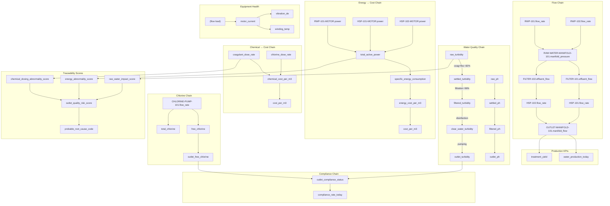
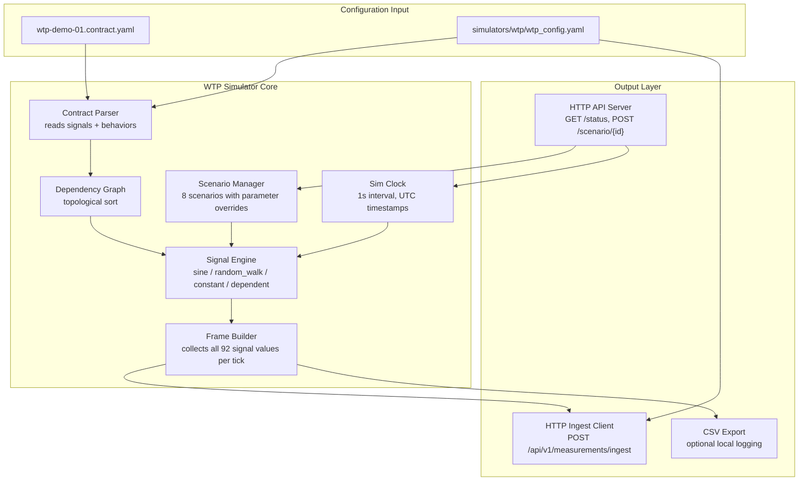

# Virtual Factory — WTP Simulator Design Document

> **Phase 8A** · WTP-DEMO-01 Water Treatment Plant Reference Model  
> **Status:** PM Design — Ready for Review  
> **Date:** 2026-07-02

---

## Table of Contents

1. [Understanding of the Challenge](#1-understanding-of-the-challenge)
2. [Signal Dependency Graph](#2-signal-dependency-graph)
3. [Simulator Architecture](#3-simulator-architecture)
4. [Data Flow: Simulator → PlantOS](#4-data-flow-simulator--plantos)
5. [Scenario Parameter Design](#5-scenario-parameter-design)
6. [API Design for Scenario Switching](#6-api-design-for-scenario-switching)
7. [Signal Value Ranges & Realism](#7-signal-value-ranges--realism)
8. [Risk Assessment](#8-risk-assessment)
9. [Task Breakdown for Coder](#9-task-breakdown-for-coder)
10. [File Structure & Module List](#10-file-structure--module-list)

---

## 1. Understanding of the Challenge

### 1.1 What We're Building

A **standalone Python WTP process simulator** that:

1. Reads the PlantOS Integration Contract v2 (`wtp-demo-01.contract.yaml`)
2. Parses the `simulation.behaviors` section to understand how each signal should behave
3. Generates realistic time-series telemetry at 1-second intervals for all 92 signals
4. Respects physical treatment process relationships (upstream → downstream signal dependencies)
5. Publishes measurements to PlantOS via `POST /api/v1/measurements/ingest`
6. Supports 8 operational scenarios with smooth transitions
7. Exposes an HTTP API for scenario switching and status queries

### 1.2 Key Decision: Standalone vs. VF Engine Integration

| Option | Pros | Cons |
|--------|------|------|
| **A. Extend VF Engine** | Reuses physics engine, sensors, gateways | 92 signals × physics models = high complexity; OPC UA already on 4840 (conflict); hard to decouple |
| **B. Standalone Simulator** ✅ | Lightweight, fast to build, easy to extend, respects contract as single source of truth | No real physics; signal generation is pattern-based |

**Decision: Option B — Standalone Simulator**

Rationale:
- The contract defines simulation behaviors declaratively (`sine`, `random_walk`, `constant`, `dependent`)
- The PM prompt explicitly says "Do NOT implement OPC UA server. Use HTTP ingestion only."
- PlantOS ingestion API is HTTP-only; no need for MQTT or OPC UA
- Standalone design allows 100% contract-driven behavior without legacy VF assumptions

### 1.3 Contract Analysis Summary

| Dimension | Value |
|-----------|-------|
| Total Signals | **92** |
| With Behavior Defined | 50 |
| Without Behavior (need defaults) | 42 |
| Behavior Patterns | `sine` (32), `random_walk` (14), `constant` (4), `dependent` (0 used in contract, but spec defines it) |
| OPC UA Bindings | 9 (not needed for this simulator) |
| PlantOS Ingestion Endpoint | `POST /api/v1/measurements/ingest` |
| Scenarios Defined | 8 (in `extensions.monitoring`, need parameter overrides) |
| Areas | 9 |
| Assets | 47 |

### 1.4 Treatment Process Flow

```
Raw Water Intake → Chemical Dosing → Flash Mixer → Flocculator → Clarifier
→ Filtration → Disinfection (Cl Contact Tank) → Clear Water Tank
→ High-Service Pumps → Distribution (Outlet Manifold)
```

Each stage transforms water quality (turbidity, pH, chlorine residual) and consumes resources (energy, chemicals).

---

## 2. Signal Dependency Graph

### 2.1 Core Dependency Chains



### 2.2 Dependency Evaluation Order

The simulator must evaluate signals in this order to ensure dependent signals can reference upstream values:

**Tier 0 (Independent - no dependencies):**
- All `sine`, `random_walk`, `constant` pattern signals
- Boolean status signals (running_status for pumps, scraper, etc.)

**Tier 1 (Depends on Tier 0):**
- `settled_turbidity` ← `raw_turbidity`
- `settled_ph` ← `raw_ph`
- `filtered_turbidity` ← `settled_turbidity`
- `filtered_ph` ← `settled_ph`
- `free_chlorine` ← `CHLORINE-PUMP-101.flow_rate` (influenced by raw_ammonia, raw_algae_index)
- `total_chlorine` ← `free_chlorine`
- `outlet_turbidity` ← `filtered_turbidity` (≈ same)
- `outlet_ph` ← `filtered_ph`

**Tier 2 (Depends on Tier 1 + upstream flows):**
- `RAW-WATER-MANIFOLD-101.manifold_pressure` ← RWP flow rates
- `OUTLET-MANIFOLD-101.manifold_flow` ← HSP flow rates
- `total_active_power` ← motor powers
- `outlet_free_chlorine` ← `free_chlorine`
- `outlet_compliance_status` ← `outlet_turbidity` + `outlet_free_chlorine`

**Tier 3 (Derived KPIs):**
- `specific_energy_consumption` ← `total_active_power` + total flow
- `energy_cost_per_m3` ← `specific_energy_consumption`
- `chemical_cost_per_m3` ← dose rates
- `cost_per_m3` ← energy_cost + chemical_cost
- `water_production_today` ← cumulative flow
- `treatment_yield` ← production / raw water input
- `outlet_quality_index` ← turbidity + chlorine + pH compliance
- `compliance_rate_today` ← `outlet_compliance_status` history
- All traceability scores ← upstream quality + dosing + energy signals

### 2.3 Signals Without Behavior (42 signals)

These signals need auto-generated defaults based on their category:

| Category | Default Pattern | Typical Parameters |
|----------|----------------|-------------------|
| Process (flow, pressure, level) | `sine` | mid from contract context, amplitude 10% of mid, noise 2% |
| Equipment Health (motor) | `random_walk` | mid from rated values, bounds ±20% |
| Status/Boolean | `constant` | `true` for normal operation |
| Water Quality (chain outputs) | `dependent` | Transform based on upstream signal |
| Energy derived | `dependent` | Calculate from power/flow signals |
| Chemical derived | `dependent` | Calculate from dose rates |
| KPI derived | `dependent` | Calculate from underlying signals |

See [Appendix A](#appendix-a---auto-generated-behaviors) for the complete auto-fill map.

---

## 3. Simulator Architecture

### 3.1 High-Level Architecture



### 3.2 Core Classes

```
┌─────────────────────────────────────────────────────────────┐
│                     WtpSimulator                            │
│  - contract_path: str                                       │
│  - config: WtpConfig                                        │
│  - contract: ContractData                                   │
│  - behaviors: dict[str, BehaviorConfig]                     │
│  - eval_order: list[str]  (topological sort)                │
│  - current_scenario: str                                    │
│  - scenario_overrides: dict[str, dict]                      │
│  - signal_state: dict[str, SignalState]   (running memory)  │
│  - clock: SimClock                                          │
│  - ingest_client: IngestClient                              │
│  - api_server: WtpApiServer (optional)                      │
│                                                             │
│  + start()                                                  │
│  + stop()                                                   │
│  + step() → MeasurementFrame                                │
│  + switch_scenario(scenario_id)                             │
│  + get_status() → dict                                      │
└─────────────────────────────────────────────────────────────┘
```

### 3.3 Signal Engine — Pattern Implementations

```python
class SignalEngine:
    """
    Generates values for all 6 pattern types.
    Each signal has state stored between ticks (for random_walk, etc.)
    """

    # Pattern: sine
    # value = mid + amplitude * sin(2π * frequency_hz * t + phase) + noise * N(0,1)
    
    # Pattern: random_walk
    # value[t] = clamp(value[t-1] + step_size * N(0,1), bounds_min, bounds_max)
    # Periodic mean-reversion toward baseline
    
    # Pattern: constant
    # value = mid + noise * N(0,1)  (noise is optional)
    
    # Pattern: step
    # value = mid + step_size * (1 if t >= trigger_time else 0) + noise * N(0,1)
    
    # Pattern: degradation
    # value = baseline + drift_rate * t + noise * N(0,1)
    
    # Pattern: dependent
    # value = evaluate_transform(transform_expr, input=upstream_value, noise=noise_fn)
    # Supports: +, -, *, /, max(a,b), min(a,b), abs(x), clamp(x,lo,hi), noise(mean,std)
```

### 3.4 Dependent Signal Transform Engine

The transform DSL must safely evaluate expressions. Implementation approach:

```python
import re
import math
import random

def evaluate_transform(expr: str, input: float, rng: random.Random) -> float:
    """
    Evaluate a transform expression string.
    
    Supported functions:
      - noise(mean, std) → Gaussian random
      - max(a, b) → maximum
      - min(a, b) → minimum
      - abs(x) → absolute value
      - clamp(x, lo, hi) → clamp to range
    
    Variables:
      - input → the upstream signal value
    
    Returns float.
    """
    # Replace function calls with safe Python equivalents
    # Use regex substitution + eval() in a restricted namespace
    safe_namespace = {
        'input': input,
        'noise': lambda m, s: rng.gauss(m, s),
        'max': max,
        'min': min,
        'abs': abs,
        'clamp': lambda x, lo, hi: max(lo, min(x, hi)),
        'math': math,
    }
    return eval(expr, {"__builtins__": {}}, safe_namespace)
```

### 3.5 Scenario Transition Smoothing

When switching scenarios, parameter changes are smoothed over a configurable window:

```python
class ScenarioManager:
    def switch_scenario(self, scenario_id: str, transition_s: float = 30.0):
        """
        Smoothly transition to a new scenario.
        
        1. Load scenario override parameters
        2. Create a transition plan: for each changed parameter,
           record (old_value, new_value, transition_duration_s)
        3. Over the next `transition_s` seconds, linearly interpolate
           between old and new parameter values
        4. After transition completes, use new value directly
        """
```

---

## 4. Data Flow: Simulator → PlantOS

### 4.1 Measurement Format

```json
POST /api/v1/measurements/ingest
Content-Type: application/json

{
  "measurements": [
    {
      "timestamp": "2026-07-02T10:00:01.000Z",
      "signal_id": "RWP-101.flow_rate",
      "value": 452.3,
      "quality": "GOOD",
      "source": "wtp-sim-01"
    },
    {
      "timestamp": "2026-07-02T10:00:01.000Z",
      "signal_id": "RAW-WATER-QUALITY-STATION-101.raw_turbidity",
      "value": 47.2,
      "quality": "GOOD",
      "source": "wtp-sim-01"
    }
    // ... up to 92 measurements per frame
  ]
}
```

### 4.2 Ingestion Client Design

```python
class IngestClient:
    """
    HTTP client for PlantOS measurement ingestion.
    
    Features:
    - POST /api/v1/measurements/ingest with JSON body
    - Configurable PlantOS base URL
    - Retry with exponential backoff (1s, 2s, 4s, 8s, max 5 retries)
    - Circuit breaker: if 5 consecutive failures, pause ingestion for 30s
    - Batching: send measurements in batches of 100 if needed
    - Local buffer: if PlantOS is down, buffer up to 3600 frames locally
      and replay when connection is restored
    """
```

### 4.3 Quality Logic

| Condition | Quality Value |
|-----------|--------------|
| Normal operation | `"GOOD"` |
| Signal near bounds (within 10% of min/max) | `"UNCERTAIN"` |
| Signal exceeds bounds | `"BAD"` |
| Upstream signal is BAD | `"UNCERTAIN"` (propagated) |
| Scenario explicitly marks signal problematic | `"UNCERTAIN"` or `"BAD"` |

---

## 5. Scenario Parameter Design

### 5.1 Scenario 1: Normal Operation

```yaml
scenario_id: normal_operation
name: Normal Operation
description: Stable production, compliant outlet quality, normal cost.
overrides: {}
# All signals use their default behavior parameters
```

### 5.2 Scenario 2: Raw Water Contamination

```yaml
scenario_id: raw_water_contamination
name: Raw Water Contamination Event
description: >
  Raw turbidity, COD, and ammonia increase sharply.
  Impact propagates through treatment chain.

overrides:
  RAW-WATER-QUALITY-STATION-101.raw_turbidity:
    mid: 85.0          # ↑ from 45.0
    amplitude: 25.0    # ↑ from 15.0
  RAW-WATER-QUALITY-STATION-101.raw_ammonia:
    mid: 1.5           # ↑ from 0.5
    amplitude: 0.5     # ↑ from 0.2
  RAW-WATER-QUALITY-STATION-101.raw_conductivity:
    mid: 550.0         # ↑ from 350.0
  LAB-SAMPLING-STATION-101.cod:
    mid: 45.0          # ↑ from ~15
    amplitude: 10.0
  # Downstream effects (settled_turbidity, filtered_turbidity, 
  # outlet_turbidity) change automatically via dependent transforms
  # because they depend on raw_turbidity

expected_effects:
  - settled_turbidity: 12-18 NTU (↑ from 6-10)
  - filtered_turbidity: 0.5-1.2 NTU (↑ from 0.2-0.5)
  - outlet_turbidity: 0.4-0.9 NTU (↑ from 0.15-0.35)
  - outlet_quality_risk_score: 5-8 (↑ from 1-3)
  - chemical_cost_per_m3: +30-50% (increased coagulant demand)
```

### 5.3 Scenario 3: Algae Bloom

```yaml
scenario_id: algae_bloom
name: Algae Bloom Event
description: >
  Raw algae index and TOC increase. Chlorine demand rises,
  free chlorine residual drops, filter run times shorten.

overrides:
  RAW-WATER-QUALITY-STATION-101.raw_algae_index:
    mid: 8.0           # ↑ from 3.0
    amplitude: 3.0     # ↑ from 1.0
  RAW-WATER-QUALITY-STATION-101.raw_ph:
    mid: 8.2           # ↑ from 7.15 (algae raises pH)
    amplitude: 0.3
  LAB-SAMPLING-STATION-101.toc:
    mid: 8.0           # ↑ from ~3
    amplitude: 2.0
  # Chlorine demand increases → free_chlorine drops
  # Filters clog faster → filter_dp rises faster

expected_effects:
  - free_chlorine: 0.3-0.5 mg/L (↓ from 0.65-0.95)
  - FILTER-101.filter_dp: rises 2x faster
  - outlet_quality_risk_score: 4-7
  - chlorine_dose_rate: +40-60%
```

### 5.4 Scenario 4: Filter Breakthrough

```yaml
scenario_id: filter_breakthrough
name: Filter Breakthrough
description: >
  Filtered turbidity rises above 1.0 NTU.
  Outlet turbidity risk increases, compliance status may fail.

overrides:
  FILTER-QUALITY-STATION-101.filtered_turbidity:
    mid: 1.2           # ↑ from 0.35 — BREAKTHROUGH
    amplitude: 0.4
  FILTER-QUALITY-STATION-101.particle_count_proxy:
    mid: 150.0         # ↑ from ~30
    amplitude: 50.0
  FILTER-QUALITY-STATION-101.filter_run_quality_index:
    mid: 0.3           # ↓ from ~0.85

expected_effects:
  - outlet_turbidity: 0.8-1.5 NTU (↑ from 0.15-0.35)
  - outlet_compliance_status: false (for turbidity > 1.0 NTU)
  - outlet_quality_risk_score: 7-9
  - probable_root_cause_code: 401 (filter breakthrough)
```

### 5.5 Scenario 5: Chlorine Underdosing

```yaml
scenario_id: chlorine_underdosing
name: Chlorine Underdosing
description: >
  Chlorine dose drops. Free chlorine residual falls below 0.2 mg/L.
  Outlet compliance fails, disinfection compromised.

overrides:
  CHLORINE-PUMP-101.flow_rate:
    mid: 3.0           # ↓ from 8.0
    amplitude: 0.5     # ↓ from 1.5
  DISINFECTION-QUALITY-STATION-101.free_chlorine:
    mid: 0.15          # ↓ from 0.8 — BELOW THRESHOLD
    amplitude: 0.05
  DISINFECTION-QUALITY-STATION-101.total_chlorine:
    mid: 0.3           # ↓ from 1.2
    amplitude: 0.05
  DISINFECTION-QUALITY-STATION-101.orp:
    mid: 350.0         # ↓ from 650.0

expected_effects:
  - outlet_free_chlorine: 0.05-0.15 mg/L (BELOW 0.2 threshold)
  - outlet_compliance_status: false
  - outlet_quality_risk_score: 8-10
  - chlorine_dose_rate: -60% (abnormal)
  - probable_root_cause_code: 501 (chlorine underdosing)
```

### 5.6 Scenario 6: Chemical Overdosing

```yaml
scenario_id: chemical_overdosing
name: Chemical Overdosing
description: >
  Coagulant and chlorine dosing rates increase above normal.
  Outlet quality remains acceptable but chemical cost rises significantly.

overrides:
  COAG-PUMP-101.flow_rate:
    mid: 22.0          # ↑ from 12.0
    amplitude: 4.0     # ↑ from 2.0
  CHLORINE-PUMP-101.flow_rate:
    mid: 15.0          # ↑ from 8.0
    amplitude: 3.0     # ↑ from 1.5
  CHEMICAL-CONSUMPTION-STATION-101.coagulant_dose_rate:
    mid: 50.0          # ↑ from 25.0
    amplitude: 10.0
  CHEMICAL-CONSUMPTION-STATION-101.chlorine_dose_rate:
    mid: 12.0          # ↑ from ~4.5
    amplitude: 3.0

expected_effects:
  - outlet_quality: STILL GOOD (no turbidity/chlorine issues)
  - chemical_cost_per_m3: +80-120% (major cost impact)
  - cost_per_m3: +30-50%
  - chemical_dosing_abnormality_score: 7-9
  - energy_abnormality_score: 2-3 (slight increase from pump load)
```

### 5.7 Scenario 7: Filter Clogging + Energy Impact

```yaml
scenario_id: filter_clogging_energy_impact
name: Filter Clogging with Energy Impact
description: >
  Filter DP rises toward 80 kPa. Pumping energy increases,
  specific energy consumption rises, outlet turbidity risk grows.

overrides:
  FILTER-101.filter_dp:
    mid: 70.0          # ↑ from 45.0 — APPROACHING ALARM
    amplitude: 10.0    # ↑ from 8.0
    bounds_max: 90.0   # ↑ from 80.0
  FILTER-102.filter_dp:
    mid: 60.0          # ↑ from 40.0
    amplitude: 8.0     # ↑ from 6.0
    bounds_max: 80.0   # ↑ from 70.0
  HSP-101-MOTOR.power:
    mid: 135.0         # ↑ from 110.0 (fighting higher DP)
    amplitude: 12.0
  HSP-101-MOTOR.motor_current:
    mid: 200.0         # ↑ from 180.0

expected_effects:
  - FILTER-101.filter_dp: 60-90 kPa (alarm at 80 kPa triggers)
  - specific_energy_consumption: 0.45-0.55 kWh/m³ (↑ from 0.33-0.43)
  - energy_cost_per_m3: +15-25%
  - cost_per_m3: +10-20%
  - outlet_turbidity: 0.3-0.6 NTU (slight increase)
  - energy_abnormality_score: 6-8
```

### 5.8 Scenario 8: High Service Pump Trip

```yaml
scenario_id: hsp_trip
name: High Service Pump Trip
description: >
  HSP-101 trips unexpectedly. Outlet manifold pressure drops,
  HSP-102 attempts to compensate but total flow decreases.

overrides:
  HSP-101.flow_rate:
    mid: 0.0           # ↓ from 320.0 — TRIPPED
    amplitude: 0.0
  HSP-101-MOTOR.motor_current:
    mid: 0.0           # ↓ from 180.0 — NO CURRENT
    bounds_min: 0.0
  HSP-101-MOTOR.power:
    mid: 0.0           # ↓ from 110.0
  HSP-102.flow_rate:
    mid: 480.0         # ↑ from ~290 (trying to compensate)
    amplitude: 30.0
  HSP-102-MOTOR.motor_current:
    mid: 200.0         # ↑ from ~155
    bounds_max: 230.0
  HIGH-SERVICE-PUMP-STATION-101.discharge_pressure:
    mid: 280.0         # ↓ from 400.0
  OUTLET-MANIFOLD-101.manifold_pressure:
    mid: 260.0         # ↓ from 380.0
  OUTLET-MANIFOLD-101.manifold_flow:
    mid: 500.0         # ↓ from ~640

expected_effects:
  - outlet manifold flow: -22%
  - outlet manifold pressure: -32%
  - water_production_today: reduced accumulation rate
  - HSP-102 motor current: near overload zone
  - energy_abnormality_score: 5-7 (HSP-102 working harder)
  - outlet_quality: minimal impact (water already treated)
```

### 5.9 Scenario Override Mechanism

```python
class ScenarioOverride:
    """Override for a single signal's behavior parameters."""
    signal_id: str
    # Any behavior parameter can be overridden:
    mid: float | None = None
    amplitude: float | None = None
    noise: float | None = None
    frequency_hz: float | None = None
    baseline: float | None = None
    bounds_min: float | None = None
    bounds_max: float | None = None
    step_size: float | None = None
    drift_rate: float | None = None
```

---

## 6. API Design for Scenario Switching

### 6.1 HTTP Endpoints

| Method | Path | Description |
|--------|------|-------------|
| `GET` | `/health` | Health check — returns `{"status": "ok"}` |
| `GET` | `/status` | Full simulator status |
| `GET` | `/scenarios` | List all scenarios with descriptions |
| `GET` | `/scenarios/current` | Get current active scenario |
| `POST` | `/scenarios/{scenario_id}` | Switch to a scenario |
| `GET` | `/telemetry/latest` | Get latest frame of all 92 signal values |
| `GET` | `/telemetry/signal/{signal_id}` | Get latest value for a specific signal |

### 6.2 Response Examples

**GET /status:**
```json
{
  "simulator": "wtp-sim-01",
  "status": "running",
  "plant_id": "WTP-DEMO-01",
  "current_scenario": "normal_operation",
  "scenario_active_since_s": 3600.0,
  "total_frames_generated": 3600,
  "total_measurements_ingested": 331200,
  "ingestion_errors": 0,
  "ingestion_status": "connected",
  "uptime_s": 3600.0,
  "signals_count": 92,
  "signals_with_behavior": 50,
  "signals_auto_generated": 42
}
```

**POST /scenarios/filter_breakthrough:**
```json
{
  "status": "transitioning",
  "from_scenario": "normal_operation",
  "to_scenario": "filter_breakthrough",
  "transition_duration_s": 30.0,
  "message": "Smoothly transitioning to filter_breakthrough over 30 seconds"
}
```

### 6.3 CLI Interface

```bash
# Start simulator with default scenario
python -m simulators.wtp.wtp_simulator \
  --contract examples/contracts/wtp-demo-01.contract.yaml \
  --config simulators/wtp/wtp_config.yaml

# Start with a specific scenario
python -m simulators.wtp.wtp_simulator \
  --contract ... \
  --scenario raw_water_contamination

# Run for N steps then exit (testing mode)
python -m simulators.wtp.wtp_simulator \
  --contract ... \
  --steps 60 \
  --output test_output.jsonl

# Switch scenario via CLI (requires running API server)
curl -X POST http://localhost:8100/scenarios/filter_breakthrough
```

---

## 7. Signal Value Ranges & Realism

### 7.1 Key Value Ranges (from PM Prompt + domain knowledge)

| Signal | Unit | Normal Range | Notes |
|--------|------|-------------|-------|
| raw_turbidity | NTU | 30-60 | Varies seasonally |
| settled_turbidity | NTU | 4-12 | ~82% reduction |
| filtered_turbidity | NTU | 0.1-0.6 | ~96% from settled |
| outlet_turbidity | NTU | 0.1-0.5 | Compliance ≤ 1.0 NTU |
| raw_ph | pH | 6.8-7.5 | Natural variation |
| outlet_ph | pH | 6.5-8.5 | Compliance range |
| free_chlorine | mg/L | 0.5-1.0 | At contact tank |
| outlet_free_chlorine | mg/L | 0.3-0.8 | After distribution |
| raw_ammonia | mg/L | 0.1-1.0 | Source dependent |
| raw_cod | mg/L | 5-25 | Source dependent |
| total_active_power | kW | 500-750 | All pumps + aux |
| specific_energy | kWh/m³ | 0.30-0.50 | Good = < 0.45 |
| cost_per_m3 | VND/m³ | 2500-4000 | Normal range |
| filter_dp | kPa | 20-60 | Clean to loaded |
| coagulant_dose_rate | mg/L | 15-40 | Raw turbidity dependent |
| flow_rate (outlet) | m³/h | 800-1000 | Design capacity |

### 7.2 Realism Checks

The simulator should log warnings when signals exceed realistic ranges:

```python
REALISM_BOUNDS = {
    "raw_turbidity": (0, 200),       # NTU — impossible negative, 200+ is extreme
    "raw_ph": (4, 10),               # pH — practical limits for surface water
    "free_chlorine": (0, 5),         # mg/L — 5+ would be dangerous overfeed
    "filter_dp": (0, 120),           # kPa — 120+ means filter is fully plugged
    "outlet_turbidity": (0, 5),      # NTU — 5+ means total treatment failure
}
```

---

## 8. Risk Assessment

### 8.1 Technical Risks

| Risk | Probability | Impact | Mitigation |
|------|-----------|--------|------------|
| **42 signals lack behavior definitions** — auto-generation may produce unrealistic values | High | Medium | Design auto-fill carefully; validate against known ranges; log warnings for out-of-range |
| **Dependent signal transform expressions** may be computationally expensive or error-prone | Medium | Medium | Use `eval()` in restricted namespace; add transform validation at startup; log errors gracefully |
| **PlantOS ingestion endpoint unavailable** — data loss | Medium | High | Implement local buffer (ring buffer, 3600 frames); replay on reconnect; exponential backoff |
| **Scenario transition smoothness** — abrupt changes look unrealistic | Low | Medium | Linear interpolation over configurable window; validate transition visually |
| **Timestamp synchronization** — clock drift between simulator and PlantOS | Low | Low | Use UTC everywhere; sync with system clock; PlantOS accepts UTC |
| **Memory growth** — 92 signals × 3600+ frames may consume significant RAM | Low | Medium | Cap in-memory history at configurable limit (default 3600); old frames discarded |

### 8.2 Scope Risks

| Risk | Probability | Impact | Mitigation |
|------|-----------|--------|------------|
| **Scope creep** — trying to add real physics instead of pattern-based generation | Medium | High | Strictly stick to contract-defined behaviors; do NOT implement CFD/chemical kinetics |
| **Contract changes** — PlantOS team updates contract format | Low | High | Isolate contract parsing in a single module; version-check contract schema |
| **87 signals without OPC UA bindings** — some users may expect OPC UA | Low | Low | PM prompt explicitly says "Do NOT implement OPC UA server" |
| **92 signals × 1s interval** = high ingestion rate for PlantOS | Medium | Medium | Batch ingestion (send frames as single POST); PlantOS should handle this rate |

### 8.3 Dependency Risks

| Dependency | Risk |
|------------|------|
| PlantOS running at `http://103.97.132.249:8000` | Must be accessible from VPS running simulator |
| `wtp-demo-01.contract.yaml` path | Must be readable; simulator validates path at startup |
| Python 3.11+ | Required for match/case and type hints |
| No external libraries beyond stdlib + `httpx` + `PyYAML` | Minimal dependency footprint |

---

## 9. Task Breakdown for Coder

### Phase 1: Foundation (Day 1-2)

| # | Task | File(s) | Est. | Dependencies |
|---|------|---------|------|-------------|
| 1.1 | Create directory structure | `simulators/wtp/` | 15m | — |
| 1.2 | Contract parser — read YAML, extract signals + behaviors | `contract_parser.py` | 1h | — |
| 1.3 | Data models — `SignalConfig`, `BehaviorConfig`, `ScenarioConfig` | `models.py` | 1h | 1.2 |
| 1.4 | Config loader — `wtp_config.yaml` with PlantOS URL, interval, etc. | `config.py` | 30m | — |
| 1.5 | Signal state tracking — per-signal memory for random_walk, degradation | `signal_state.py` | 1h | 1.3 |

### Phase 2: Signal Engine (Day 2-3)

| # | Task | File(s) | Est. | Dependencies |
|---|------|---------|------|-------------|
| 2.1 | Sine pattern generator | `signal_engine.py` | 30m | 1.5 |
| 2.2 | Random walk generator with mean-reversion + bounds | `signal_engine.py` | 1h | 1.5 |
| 2.3 | Constant + step pattern generators | `signal_engine.py` | 30m | 1.5 |
| 2.4 | Degradation pattern generator | `signal_engine.py` | 30m | 1.5 |
| 2.5 | Dependent signal transform engine (DSL parser + evaluator) | `transform_engine.py` | 2h | 1.5 |
| 2.6 | Dependency graph builder (topological sort) | `dependency_graph.py` | 1h | 1.2, 1.3 |
| 2.7 | Auto-behavior generator for 42 missing signals | `auto_behavior.py` | 1h | 1.2, 2.1-2.4 |
| 2.8 | Frame builder — collect all 92 signals into one measurement frame | `frame_builder.py` | 1h | 2.1-2.7 |

### Phase 3: Scenario System (Day 3)

| # | Task | File(s) | Est. | Dependencies |
|---|------|---------|------|-------------|
| 3.1 | Scenario loader — read scenario YAML files | `scenario_manager.py` | 1h | 1.3 |
| 3.2 | Scenario override application — merge overrides into behaviors | `scenario_manager.py` | 1h | 3.1, 1.5 |
| 3.3 | Smooth transition engine — linear interpolation between params | `scenario_manager.py` | 1.5h | 3.2 |
| 3.4 | Create 8 scenario YAML files with parameter overrides | `scenarios/*.yaml` | 2h | 3.1 |

### Phase 4: Ingestion (Day 3-4)

| # | Task | File(s) | Est. | Dependencies |
|---|------|---------|------|-------------|
| 4.1 | HTTP ingest client — POST measurements to PlantOS | `ingest_client.py` | 2h | 2.8 |
| 4.2 | Retry logic — exponential backoff + jitter | `ingest_client.py` | 1h | 4.1 |
| 4.3 | Local buffer — ring buffer for offline replay | `ingest_client.py` | 1h | 4.1 |
| 4.4 | CSV/JSONL export for local logging (optional) | `export.py` | 30m | 2.8 |

### Phase 5: API + CLI (Day 4)

| # | Task | File(s) | Est. | Dependencies |
|---|------|---------|------|-------------|
| 5.1 | HTTP API server (FastAPI) — status, scenario switching | `api_server.py` | 2h | 3.2 |
| 5.2 | CLI entry point — argparse + main loop | `wtp_simulator.py` | 1h | 2.8, 4.1, 5.1 |
| 5.3 | Main simulator class — orchestrates all components | `wtp_simulator.py` | 1h | All above |

### Phase 6: Testing (Day 4-5)

| # | Task | File(s) | Est. | Dependencies |
|---|------|---------|------|-------------|
| 6.1 | Unit tests — signal generators (sine, random_walk, etc.) | `tests/test_signal_generation.py` | 1h | Phase 2 |
| 6.2 | Unit tests — dependent signal transform engine | `tests/test_dependent_signals.py` | 1h | 2.5 |
| 6.3 | Unit tests — scenario loading and overrides | `tests/test_scenarios.py` | 1h | Phase 3 |
| 6.4 | Integration test — contract parsing → frame generation | `tests/test_integration.py` | 1h | Phase 2 |
| 6.5 | Integration test — HTTP ingestion (mock PlantOS) | `tests/test_ingestion.py` | 1h | Phase 4 |
| 6.6 | Scenario validation — all 8 scenarios produce correct effects | `tests/test_scenario_effects.py` | 2h | All phases |

### Phase 7: Documentation & Deployment (Day 5)

| # | Task | File(s) | Est. |
|---|------|---------|------|
| 7.1 | README with usage examples | `simulators/wtp/README.md` | 1h |
| 7.2 | Systemd service file for production deployment | `deploy/wtp-simulator.service` | 30m |
| 7.3 | Smoke test on VPS with PlantOS | — | 1h |

### Total Estimated: 5 days

---

## 10. File Structure & Module List

```
virtual-factory/
├── simulators/
│   └── wtp/
│       ├── __init__.py
│       ├── wtp_simulator.py          # Main simulator class + CLI entry point
│       ├── contract_parser.py        # Reads wtp-demo-01.contract.yaml
│       ├── models.py                 # Data classes: SignalConfig, BehaviorConfig, ScenarioConfig
│       ├── config.py                 # WtpConfig loader (PlantOS URL, interval, etc.)
│       ├── signal_engine.py          # Pattern generators: sine, random_walk, constant, step, degradation
│       ├── signal_state.py           # Per-signal running state (value, phase, walk position)
│       ├── transform_engine.py       # Dependent signal transform expression evaluator
│       ├── dependency_graph.py       # Topological sort of signal dependency DAG
│       ├── auto_behavior.py          # Auto-generates behaviors for 42 undefined signals
│       ├── frame_builder.py          # Collects all 92 signal values into a measurement frame
│       ├── scenario_manager.py       # Scenario loading, overrides, smooth transitions
│       ├── ingest_client.py          # HTTP client for PlantOS ingestion + retry + buffer
│       ├── export.py                 # CSV/JSONL file export
│       ├── api_server.py             # FastAPI server for status + scenario switching
│       │
│       ├── wtp_config.yaml           # Default configuration
│       │
│       ├── scenarios/                # 8 scenario definition files
│       │   ├── normal_operation.yaml
│       │   ├── raw_water_contamination.yaml
│       │   ├── algae_bloom.yaml
│       │   ├── filter_breakthrough.yaml
│       │   ├── chlorine_underdosing.yaml
│       │   ├── chemical_overdosing.yaml
│       │   ├── filter_clogging_energy_impact.yaml
│       │   └── hsp_trip.yaml
│       │
│       ├── tests/
│       │   ├── __init__.py
│       │   ├── test_signal_generation.py
│       │   ├── test_dependent_signals.py
│       │   ├── test_scenarios.py
│       │   ├── test_ingestion.py
│       │   ├── test_integration.py
│       │   └── test_scenario_effects.py
│       │
│       ├── requirements.txt          # httpx, pyyaml, fastapi, uvicorn
│       └── README.md                 # Usage documentation
│
├── deploy/
│   └── wtp-simulator.service         # Systemd service file
│
└── docs/
    └── wtp-simulator-design.md       # THIS DOCUMENT
```

### Requirements (`simulators/wtp/requirements.txt`):

```
pyyaml>=6.0
httpx>=0.27
fastapi>=0.110
uvicorn[standard]>=0.27
```

### Config Template (`simulators/wtp/wtp_config.yaml`):

```yaml
# WTP Simulator Configuration
simulator:
  name: wtp-sim-01
  source: wtp-sim-01
  interval_s: 1.0          # Tick interval (seconds)
  max_frames_buffer: 3600  # In-memory ring buffer size
  auto_start: true         # Start simulation on launch

plantos:
  base_url: http://103.97.132.249:8000
  ingest_endpoint: /api/v1/measurements/ingest
  retry:
    max_retries: 5
    base_delay_s: 1.0
    max_delay_s: 30.0
    backoff_multiplier: 2.0

scenario:
  default: normal_operation
  transition_s: 30.0       # Smooth transition duration

api:
  host: 0.0.0.0
  port: 8100               # Different from VF API on 8002

logging:
  level: INFO
  file: logs/wtp_simulator.log
```

---

## Appendix A — Auto-Generated Behaviors

For the 42 signals without explicit behaviors, the simulator will auto-generate defaults:

| Signal ID | Auto Pattern | Auto Parameters |
|-----------|-------------|----------------|
| `INTAKE-STRUCTURE-101.inlet_valve_position` | `constant` | `mid: 80.0` |
| `SCREEN-101.running_status` | `constant` | `mid: 1.0` (true) |
| `RAW-WATER-PUMP-STATION-101.discharge_pressure` | `sine` | `mid: 350.0, amplitude: 15.0, noise: 5.0` |
| `RWP-101.running_status` | `constant` | `mid: 1.0` |
| `RWP-102.flow_rate` | `sine` | `mid: 440.0, amplitude: 30.0, noise: 5.0` |
| `RWP-102-MOTOR.motor_current` | `random_walk` | `mid: 92.0, amplitude: 5.0, bounds: 80-108` |
| `COAG-TANK-101.temperature` | `sine` | `mid: 25.0, amplitude: 3.0, noise: 0.5` |
| `COAGULATION-CONTROL-STATION-101.floc_size_index` | `sine` | `mid: 3.5, amplitude: 0.5, noise: 0.1` |
| `PH-PUMP-101.flow_rate` | `sine` | `mid: 5.0, amplitude: 1.0, noise: 0.2` |
| `CLARIFIER-SCRAPER-101.running_status` | `constant` | `mid: 1.0` |
| `SLUDGE-PUMP-101.running_status` | `step` | `mid: 0.0, step_size: 1.0` (intermittent) |
| `CLARIFIER-QUALITY-STATION-101.clarifier_efficiency_index` | `dependent` | `depends_on: settled_turbidity, transform: "clamp(0.5, 0.99, 1.0 - input/100)"` |
| `FILTER-101.filter_level` | `sine` | `mid: 1.5, amplitude: 0.2, noise: 0.05` |
| `FILTER-102.filter_level` | `sine` | `mid: 1.4, amplitude: 0.2, noise: 0.05` |
| `BACKWASH-PUMP-101.running_status` | `constant` | `mid: 0.0` (off normally) |
| `FILTER-QUALITY-STATION-101.filtered_ph` | `dependent` | `depends_on: settled_ph, transform: "input + noise(0, 0.05)"` |
| `FILTER-QUALITY-STATION-101.particle_count_proxy` | `dependent` | `depends_on: filtered_turbidity, transform: "max(0, input * 100 + noise(0, 10))"` |
| `FILTER-QUALITY-STATION-101.filter_run_quality_index` | `dependent` | `depends_on: FILTER-101.filter_dp, transform: "clamp(0, 1, 1.0 - (input - 20)/100)"` |
| `CONTACT-TANK-101.level` | `sine` | `mid: 65.0, amplitude: 5.0, noise: 1.0` |
| `CLEAR-WATER-TANK-101.quality_index` | `dependent` | `depends_on: outlet_turbidity, transform: "clamp(0, 1, 1.0 - input/2)"` |
| `CLEAR-WATER-QUALITY-STATION-101.clear_water_turbidity` | `dependent` | `depends_on: filtered_turbidity, transform: "input * 0.95 + noise(0, 0.02)"` |
| `TRANSFER-PUMP-101.running_status` | `constant` | `mid: 1.0` |
| `HSP-102.flow_rate` | `sine` | `mid: 320.0, amplitude: 20.0, noise: 5.0` |
| `HSP-102-MOTOR.motor_current` | `random_walk` | `mid: 155.0, amplitude: 8.0, bounds: 130-180` |
| `HSP-102-MOTOR.power` | `random_walk` | `mid: 95.0, amplitude: 6.0, noise: 1.0` |
| `OUTLET-MANIFOLD-101.manifold_flow` | `dependent` | `depends_on: HSP-101.flow_rate, transform: "input + HSP_102_flow + noise(0, 5)"` |
| `TRANSFER-OUTLET-QUALITY-STATION-101.outlet_ph` | `dependent` | `depends_on: filtered_ph, transform: "clamp(6.5, 8.5, input + noise(0, 0.05))"` |
| `TRANSFER-OUTLET-QUALITY-STATION-101.outlet_compliance_status` | `dependent` | `depends_on: outlet_turbidity, transform: "1.0 if input <= 1.0 and outlet_cl <= 5.0 and outlet_cl >= 0.2 else 0.0"` |
| `TRANSFORMER-101.oil_temp` | `random_walk` | `mid: 55.0, amplitude: 3.0, bounds: 40-70` |
| `ENERGY-MONITORING-STATION-101.total_energy_today` | `dependent` | Cumulative: `sum(total_active_power * 1/3600) kWh` |
| `ENERGY-MONITORING-STATION-101.energy_cost_per_m3` | `dependent` | `depends_on: specific_energy_consumption, transform: "input * 2500"` |
| `ENERGY-MONITORING-STATION-101.peak_demand` | `dependent` | Rolling max of `total_active_power` |
| `MCC-101.runtime_hours` | `degradation` | `baseline: 0, drift_rate: 1/3600` (1 hour per hour) |
| `LAB-SAMPLING-STATION-101.cod` | `sine` | `mid: 15.0, amplitude: 5.0, noise: 1.0` |
| `LAB-SAMPLING-STATION-101.toc` | `sine` | `mid: 3.0, amplitude: 1.0, noise: 0.3` |
| `QUALITY-TRACEABILITY-ENGINE-101.raw_water_impact_score` | `dependent` | `depends_on: raw_turbidity, transform: "clamp(0, 10, input/15)"` |
| `QUALITY-TRACEABILITY-ENGINE-101.chemical_dosing_abnormality_score` | `dependent` | `depends_on: coagulant_dose_rate, transform: "clamp(0, 10, abs(input - 25)/5)"` |
| `QUALITY-TRACEABILITY-ENGINE-101.energy_abnormality_score` | `dependent` | `depends_on: specific_energy_consumption, transform: "clamp(0, 10, (input - 0.35)/0.02)"` |
| `PLANT-KPI-101.outlet_quality_index` | `dependent` | Composite: `(1.0 - outlet_turbidity/2) * (outlet_cl_ratio) * (ph_in_range)` |
| `PLANT-KPI-101.compliance_rate_today` | `dependent` | Rolling % of frames where compliance_status is true |
| `CHEMICAL-CONSUMPTION-STATION-101.chlorine_dose_rate` | `dependent` | `depends_on: CHLORINE-PUMP-101.flow_rate, transform: "input * 0.375"` (L/min→mg/L conversion) |
| `CHEMICAL-CONSUMPTION-STATION-101.chemical_cost_per_m3` | `dependent` | `depends_on: coagulant_dose_rate, transform: "coagulant_dose_rate * 30 + chlorine_dose_rate * 50"` |

---

## Summary

This design:
1. **Respects the contract** as the single source of truth
2. **Is a standalone simulator** — minimal dependencies, easy deployment
3. **Covers all 92 signals** — 50 with explicit behaviors, 42 with auto-generated defaults
4. **Supports 8 scenarios** with realistic parameter overrides and smooth transitions
5. **Publishes via HTTP** to PlantOS ingestion endpoint
6. **Has retry logic** with exponential backoff and local buffering
7. **Provides HTTP API** for scenario switching, status monitoring
8. **Is testable** — each component is independently testable
9. **Estimated 5 days** of coding effort
